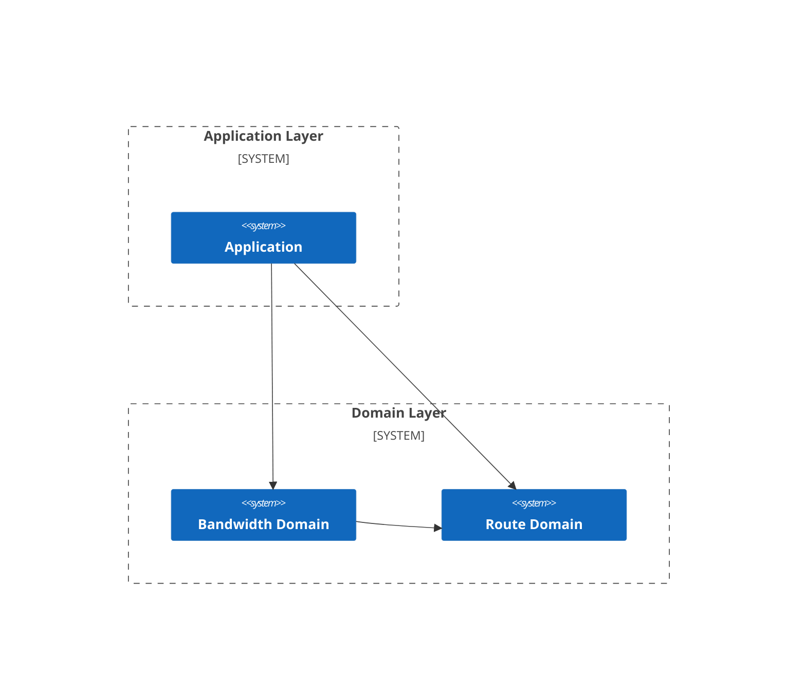

# Framework Example 1: Service Placement Problem

## Problem Description

In a given telecommunications network structure, in order to deliver video content to each residential area quickly and at low cost, it is necessary to place video content storage servers near selected network nodes within this predefined network architecture.

<div align="center">
  
</div>

It is now known that:
1. Each link has a bandwidth $Bandwidth^{Max}$ and bandwidth cost $Cost^{Bandwidth}$ ;
2. Each server has a capacity $Capacity$ and service cost $Cost^{Service}$ ;
3. Each consumer node has a demand $Demand$ .

Determine the placement locations of video content storage servers and the bandwidth links to minimize server usage costs and link usage costs, while satisfying the following conditions:
1. At most one server can be deployed at each node;
2. Each server can be deployed to at most one node;
3. All residential area video playback demands must be met;
4. The traffic at transit nodes must be balanced.

## Business Architecture



## Mathematical Model

### Route Domain

#### Variables

$x_{is} \in \{0, 1\}$: whether server $s$ is deployed on node $i$.

#### Intermediate Expressions

##### 1. Whether Any Server is Deployed on Node

$$
Assignment^{Node}_{i} = \sum_{s \in S} x_{is}, \; \forall i \in N^{N}
$$

##### 2. Whether Server is Deployed on Any Node

$$
Assignment^{Server}_{s} = \sum_{i \in N^{N}} x_{is}, \; \forall s \in S
$$

#### Objective Function

##### 1. Minimize Server Cost

**Description**: Minimize the total cost of deploying servers on nodes.

$$
min \quad \sum_{s \in S} Cost^{Service}_{s} \cdot Assignment^{Service}_{s}
$$

#### Constraints

##### 1. Node Deployment Limit

**Description**: At most one server can be deployed on each node.

$$
s.t. \quad Assignment^{Node}_{i} \leq 1, \; \forall i \in N^{N}
$$

##### 2. Server Deployment Limit

**Description**: Each server can be deployed to at most one node.

$$
s.t. \quad Assignment^{Server}_{s} \leq 1, \; \forall s \in S
$$

### Bandwidth Domain

#### Variables

$y_{e_{ij}, s} \in R^{\ast}$: whether link $e_{ij}$ is used by server $s$.

#### Intermediate Expressions

##### 1. Bandwidth Usage

$$
Bandwidth_{e_{ij}} = \sum_{s \in S} y_{e_{ij}, s}, \; \forall i \in N^{N}, \; \forall j \in N
$$

##### 2. Indegree Bandwidth

$$
Bandwidth^{Indegree, Service}_{js} = \sum_{i \in N^{N}} y_{e_{ij}, s}, \; \forall j \in N, \; \forall s \in S
$$

$$
Bandwidth^{Indegree, Node}_{j} = \sum_{s \in S} Bandwidth^{Indegree, Service}_{js}, \; \forall j \in N
$$

##### 3. Outdegree Bandwidth

$$
Bandwidth^{Outdegree, Service}_{is} = \sum_{j \in N} y_{e_{ij}, s}, \; \forall i \in N^{N}, \; \forall s \in S
$$

$$
Bandwidth^{Outdegree, Node}_{i} = \sum_{s \in S} Bandwidth^{Outdegree, Service}_{js}, \; \forall i \in N^{N}
$$

##### 4. OutFlow Bandwidth

$$
Bandwidth^{OutFlow, Service}_{is} = Bandwidth^{Outdegree, Service}_{is} - Bandwidth^{Indegree, Service}_{is}, \; \forall i \in N^{N}, \; \forall s \in S
$$

$$
Bandwidth^{OutFlow, Node}_{i} = \sum_{s \in S} Bandwidth^{OutFlow, Service}_{is}, \; \forall i \in N^{N}
$$

#### Objective Function

##### 1. Minimize Bandwidth Usage Cost

**Description**: Minimize the total cost of using bandwidth on links.

$$
min \quad \sum_{i \in N^{N}}\sum_{j \in N^{N}} Cost^{Bandwidth}_{e_{ij}} \cdot Bandwidth_{e_{ij}}
$$

#### Constraints

##### 1. Bandwidth Usage Limit

**Description**: The bandwidth usage of each link not to exceed its maximum capacity and ensures that only servers can consume bandwidth.

$$
s.t. \quad y_{e_{ij}, s} \leq Bandwidth^{Max}_{e_{ij}} \cdot Assignment^{Service}_{s}, \; \forall i \in N^{N}, \; \forall j \in N, \; \forall s \in S
$$

##### 2. Demand Satisfaction Limit

**Description**: Enforce the satisfaction of consumer node demands.

$$
s.t. \quad \sum_{s \in S} Bandwidth^{OutFlow, Service}_{is} \geq Demand_{i}, \; \forall i \in N^{C}
$$

##### 3. Flow Balance Limit

**Description**: Impose flow balance constraints on transit nodes.

$$
s.t. \quad \sum_{j \in N} y_{e_{ij}, s} - \sum_{j \in N^{N}} y_{e_{ji}, s} \leq \sum_{j \in N} Bandwidth^{Max}_{e_{ij}} \cdot Assignment^{Service}_{s}, \; \forall i \in N^{N}, \; \forall s \in S
$$

##### 4. Server Capacity Limit

**Description**: Limit the outflow of server nodes to their capacity.

$$
s.t. \quad \sum_{j \in N} y_{e_{ij}, s} - \sum_{j \in N^{N}} y_{e_{ji}, s} \leq Capacity_{s} \cdot Assignment^{Service}_{s}, \; \forall i \in N^{N}, \; \forall s \in S
$$

## Code Implementation

### Route Domain

::: code-group

```kotlin
import fuookami.ospf.kotlin.utils.math.*
import fuookami.ospf.kotlin.utils.concept.*
import fuookami.ospf.kotlin.utils.functional.*
import fuookami.ospf.kotlin.utils.multi_array.*
import fuookami.ospf.kotlin.core.frontend.variable.*
import fuookami.ospf.kotlin.core.frontend.expression.monomial.*
import fuookami.ospf.kotlin.core.frontend.expression.polynomial.*
import fuookami.ospf.kotlin.core.frontend.expression.symbol.*
import fuookami.ospf.kotlin.core.frontend.inequality.*
import fuookami.ospf.kotlin.core.frontend.model.mechanism.*

class Service(
    val capacity: UInt64,
    val cost: UInt64
) : AutoIndexed(Service::class) {}

sealed class Node(
    val edges: List<Edge>
) : AutoIndexed(Node::class) {}

class NormalNode(
    edges: List<Edge>
) : Node(edges) {}

class ClientNode(
    edges: List<Edge>,
    val demand: UInt64
) : Node(edges) {}

class Edge(
    val from: Node,
    val to: Node,
    val maxBandwidth: UInt64,
    val costPerBandwidth: UInt64
) : AutoIndexed(Edge::class) {}

data class Graph(
    val nodes: ArrayList<Node>,
    val edges: ArrayList<Edge>
) {}

// define decision objects
class Assignment(
    private val nodes: List<Node>,
    private val services: List<Service>
) {
    lateinit var x: BinVariable2
    lateinit var nodeAssignment: LinearIntermediateSymbols1
    lateinit var serviceAssignment: LinearIntermediateSymbols1

    fun register(model: LinearMetaModel) {
        if (!::x.isInitialized) {
            x = BinVariable2("x", Shape2(nodes.size, services.size))
            for (service in services) {
                for (node in nodes.filter { it is NormalNode }) {
                    x[node, service].name = "${x.name}_${node}_$service"
                }
                for (node in nodes.filter { it is ClientNode }) {
                    val variable = x[node, service]
                    variable.name = "${x.name}_${node}_$service"
                    variable.range.eq(false)
                }
            }
        }
        model.add(x)

        if (!::nodeAssignment.isInitialized) {
            nodeAssignment = flatMap(
                "node_assignment",
                nodes,
                { n ->
                    if (n is NormalNode) {
                        sum(x[n, _a])
                    } else {
                        LinearPolynomial()
                    }
                },
                { (_, n) -> "$n" }
            )
        }
        model.add(nodeAssignment)

        if (!::serviceAssignment.isInitialized) {
            serviceAssignment = flatMap(
                "service_assignment",
                services,
                { s -> sumVars(nodes.filter { it is NormalNode }) { n -> x[n, s] } },
                { (_, s) -> "$s" }
            )
        }
        model.add(serviceAssignment)
    }
}

// define context
class RouteContext(
    val graph: Graph,
    val services: List<Service>,
) {
    lateinit var assignment: Assignment

    fun register(model: LinearMetaModel) {
        // register decision objects (varaibles and intermediate expressions) to the model
        if (!::assignment.isInitialized) {
            assignment = Assignment(graph.nodes, services)
        }
        assignment.register(model)

        // define objective function
         model.minimize(
            sum(services) { it.cost * assignment.serviceAssignment[it] },
            "service cost"
        )

        // define constraints
        for (node in graph.nodes.filter { it is NormalNode }) {
            model.addConstraint(
                assignment.nodeAssignment[node] leq 1,
                "node_assignment_$node"
            )
        }

        for (service in services) {
            model.addConstraint(
                assignment.serviceAssignment[service] leq 1,
                "service_assignment_$service"
            )
        }
    }
}
```

:::

### Bandwidth Domain

::: code-group

```kotlin
import fuookami.ospf.kotlin.utils.math.*
import fuookami.ospf.kotlin.utils.functional.*
import fuookami.ospf.kotlin.utils.multi_array.*
import fuookami.ospf.kotlin.core.frontend.variable.*
import fuookami.ospf.kotlin.core.frontend.expression.monomial.*
import fuookami.ospf.kotlin.core.frontend.expression.polynomial.*
import fuookami.ospf.kotlin.core.frontend.expression.symbol.*
import fuookami.ospf.kotlin.core.frontend.inequality.*
import fuookami.ospf.kotlin.core.frontend.model.mechanism.*

// define decision objects
class EdgeBandwidth(
    private val edges: List<Edge>,
    private val services: List<Service>
) {
    lateinit var y: UIntVariable2
    lateinit var bandwidth: LinearIntermediateSymbols1

    fun register(model: LinearMetaModel) {
        if (!::y.isInitialized) {
            y = UIntVariable2("y", Shape2(edges.size, services.size))
            for (service in services) {
                for (edge in edges.filter(from(normal))) {
                    y[edge, service].name = "${y.name}_${edge}_$service"
                    y[edge, service].range.leq(edge.maxBandwidth)
                }
                for (edge in edges.filter(!from(normal))) {
                    y[edge, service].range.eq(UInt64.zero)
                }
            }
        }
        model.add(y)

        if (!::bandwidth.isInitialized) {
            bandwidth = flatMap(
                "bandwidth",
                edges,
                { e ->
                    if (e.from is NormalNode) {
                        sum(y[e, _a])
                    } else {
                        LinearPolynomial()
                    }
                },
                { (_, e) -> "$e" }
            )
        }
        model.add(bandwidth)
    }
}

class ServiceBandwidth(
    private val graph: Graph,
    private val services: List<Service>,
    private val edgeBandwidth: EdgeBandwidth
) {
    lateinit var inDegree: LinearIntermediateSymbols2
    lateinit var outDegree: LinearIntermediateSymbols2
    lateinit var outFlow: LinearIntermediateSymbols2

    fun register(model: LinearMetaModel) {
        val y = edgeBandwidth.y
        val to: (Node) -> Predicate<Edge> =
            { fuookami.ospf.kotlin.example.framework_demo.demo1.domain.route_context.model.to(it) }

        if (!::inDegree.isInitialized) {
            inDegree = flatMap(
                "bandwidth_indegree_service",
                graph.nodes,
                services,
                { n, s -> sumVars(graph.edges.filter(to(n))) { e -> y[e, s] } },
                { (_, n), (_, s) -> "${n}_$s" }
            )
        }
        model.add(inDegree)

        if (!::outDegree.isInitialized) {
            outDegree = flatMap(
                "bandwidth_outdegree_service",
                graph.nodes,
                services,
                { n, s ->
                    if (n is NormalNode) {
                        sumVars(graph.edges.filter(from(n))) { e -> y[e, s] }
                    } else {
                        LinearPolynomial()
                    }
                },
                { (_, n), (_, s) -> "${n}_$s" }
            )
        }
        model.add(outDegree)

        if (!::outFlow.isInitialized) {
            outFlow = flatMap(
                "bandwidth_outflow_service",
                graph.nodes,
                services,
                { n, s ->
                    if (n is NormalNode) {
                        outDegree[n, s] - inDegree[n, s]
                    } else {
                        LinearPolynomial()
                    }
                },
                { (_, n), (_, s) -> "${n}_$s" }
            )
        }
        model.add(outFlow)
    }
}

class NodeBandwidth(
    private val nodes: List<Node>,
    private val serviceBandwidth: ServiceBandwidth
) {
    lateinit var inDegree: LinearIntermediateSymbols1
    lateinit var outDegree: LinearIntermediateSymbols1
    lateinit var outFlow: LinearIntermediateSymbols1

    fun register(model: LinearMetaModel): Try {
        if (!::inDegree.isInitialized) {
            inDegree = flatMap(
                "bandwidth_indegree_node",
                nodes,
                { n -> sum(serviceBandwidth.inDegree[n, _a]) },
                { (_, n) -> "$n" }
            )
        }
        model.add(inDegree)

        if (!::outDegree.isInitialized) {
            outDegree = flatMap(
                "bandwidth_outdegree_node",
                nodes,
                { n ->
                    if (n is NormalNode) {
                        sum(serviceBandwidth.outDegree[n, _a])
                    } else {
                        LinearPolynomial()
                    }
                },
                { (_, n) -> "$n" }
            )
        }
        model.add(outDegree)

        if (!::outFlow.isInitialized) {
            outFlow = flatMap(
                "bandwidth_outflow_node",
                nodes,
                { n ->
                    if (n is NormalNode) {
                        sum(serviceBandwidth.outFlow[n, _a])
                    } else {
                        LinearPolynomial()
                    }
                },
                { (_, n) -> "$n" }
            )
        }
        model.add(outFlow)
    }
}

// define context
class BandwidthContext() {
    lateinit var edgeBandwidth: EdgeBandwidth,
    lateinit var serviceBandwidth: ServiceBandwidth,
    lateinit var nodeBandwidth: NodeBandwidth

    fun register(
        routeContext: RouteContext,
        model: LinearMetaModel
    ) {
        val graph = routeContext.graph
        val services = routeContext.services
        val assignment = routeContext.assignment

        // register decision objects (varaibles and intermediate expressions) to the model
        if (!::edgeBandwidth.isInitialized) {
            edgeBandwidth = EdgeBandwidth(graph.edges, services)
        }
        edgeBandwidth.register(model)

        if (!::serviceBandwidth.isInitialized) {
            serviceBandwidth = ServiceBandwidth(graph, services, edgeBandwidth)
        }
        serviceBandwidth.register(model)

        if (!::nodeBandwidth.isInitialized) {
            nodeBandwidth = NodeBandwidth(graph.nodes, serviceBandwidth)
        }
        nodeBandwidth.register(model)

        // define objective function
        model.minimize(
            sum(graph.edges.filter { it.from is NormalNode }) { 
                it.costPerBandwidth * edgeBandwidth.bandwidth[it]
            },
            "bandwidth cost"
        )

        // define constraints
        for (edge in graph.edges.filter { it.from is NormalNode }) {
            for (service in services) {
                model.addConstraint(
                    edgeBandwidth.y[edge, service] leq assignment.assignment[service] * edge.maxBandwidth,
                    "edge_bandwidth_constraint_($edge,$service)"
                )
            }
        }

        for (node in graph.nodes.filter { it is ClientNode }) {
            model.addConstraint(
                nodeBandwidth.inDegree[node] geq (node as ClientNode).demand,
                "demand_constraint_$node"
            )
        }

        for (node in graph.nodes.filter { it.from is NormalNode }) {
            for (service in services) {
                model.addConstraint(
                    serviceBandwidth.outFlow[node, service] leq assignment.x[node, service] * service.capacity,
                    "service_capacity_constraint_($node,$service)"
                )
            }
        }

        for (node in graph.nodes.filter { it.from is NormalNode }) {
            val maxOutDegree = node.edges.sumOf { it.maxBandwidth }
            model.addConstraint(
                nodeBandwidth.outFlow[node] leq assignment.assignment[node] * maxOutDegree,
                "transfer_node_bandwidth_constraint_$node"
            )
        }
    }

    fun analyze(model: LinearMetaModel): List<List<Node>> { 
        ...
    }
}
```

:::

### Application

::: code-group

```kotlin
import fuookami.ospf.kotlin.core.frontend.model.mechanism.*
import fuookami.ospf.kotlin.core.backend.plugins.scip.*

val graphs = ... // graph data
val services = ... // service data

// create a model instance
val metaModel = LinearMetaModel("demo1")

// create domain contexts
val routeContext = RouteContext(graph, services)
val bandwidthContext = BandwidthContext()

// register contexts (variables, intermediate expressions, constraints and objective function) to the model
routeContext.register(metaModel)
bandwidthContext.register(routeContext, metaModel)

// solve the model
val solver = ScipLinearSolver()
when (val ret = solver(metaModel)) {
    is Ok -> {
        metaModel.tokens.setSolution(ret.value.solution)
    }

    is Failed -> {}
}

// parse results
val solution = bandwidthContext.analyze(metaModel)
```

For the complete implementation, please refer to:

- [Kotlin](https://github.com/fuookami/ospf/tree/main/examples/ospf-kotlin-example/src/main/fuookami/ospf/kotlin/example/framework_demo/demo1)
