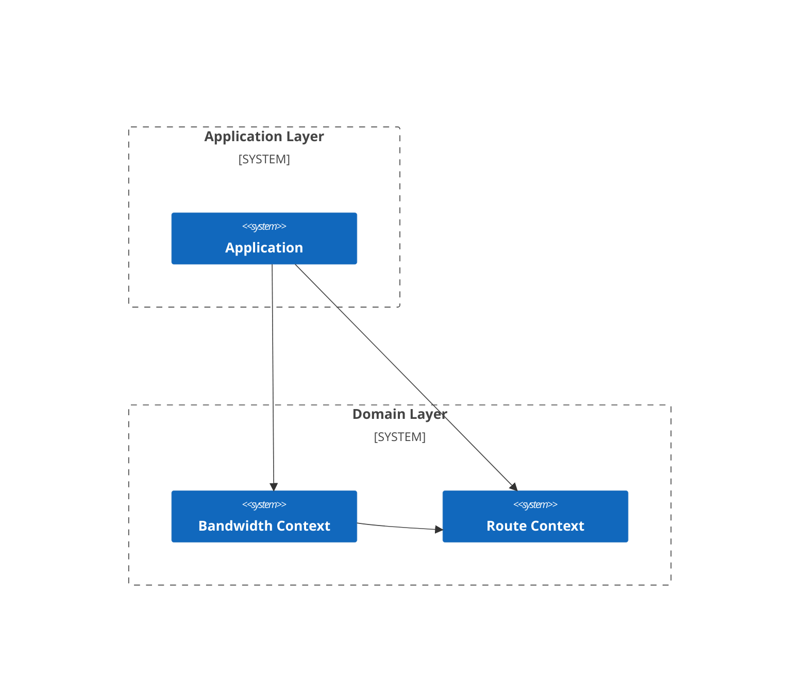

# Complex Example 1: Server Placement Problem

## Problem Description

In a given telecommunications network structure, to quickly and cost-effectively deliver video content to each residential area, video content storage servers need to be placed near some network nodes in this given network structure.

<div align="center">
  
</div>

Currently known:
1. Each link has bandwidth $Bandwidth^{Max}$ and bandwidth cost $Cost^{Bandwidth}$;
2. Each server has load capacity $Capacity$ and usage cost $Cost^{Service}$;
3. Each consumer node has demand $Demand$.

Determine the placement locations for video content storage servers and bandwidth links to minimize server usage cost and link usage cost, while satisfying the following conditions:
1. Each node can deploy at most one server;
2. Each server can be deployed to at most one node;
3. Meet all residential area video playback demands;
4. Transit node traffic must be balanced.

## Business Architecture


```mermaid
C4Context
  System_Boundary(application_layer, "Application Layer") {
    System(application, "Application")
  }
  System_Boundary(domain_layer, "Domain Layer") {
    System(bandwidth_context, "Bandwidth Context")
    System(route_context, "Route Context")
  }

  Rel(application, route_context, "", "")
  Rel(application, bandwidth_context, "", "")
  Rel(bandwidth_context, route_context, "", "")

  UpdateLayoutConfig($c4ShapeInRow="3", $c4BoundaryInRow="1")
```

## Mathematical Model

### Route Context

#### Variables

$x_{is} \in \{0, 1\}$: Deploy server $s$ at normal node $i$.

#### Intermediate Values

##### 1. Whether Server is Deployed at Node

$$
\text{Assignment}^{\text{Node}}_{i} = \sum_{s \in S} x_{is}, \; \forall i \in N^{N}
$$

##### 2. Whether Server is Deployed

$$
\text{Assignment}^{\text{Service}}_{s} = \sum_{i \in N^{N}} x_{is}, \; \forall s \in S
$$

#### Objective Function

##### 1. Minimize Server Deployment Cost

**Description**: Server usage cost should be as low as possible.

$$
\min \quad \sum_{s \in S} \text{Cost}^{\text{Service}}_{s} \cdot \text{Assignment}^{\text{Service}}_{s}
$$

#### Constraints

##### 1. Node Deployment Constraint

**Description**: Each node can deploy at most one server.

$$
\text{s.t.} \quad \text{Assignment}^{\text{Node}}_{i} \leq 1, \; \forall i \in N^{N}
$$

##### 2. Server Deployment Constraint

**Description**: Each server can be deployed to at most one node.

$$
\text{s.t.} \quad \text{Assignment}^{\text{Service}}_{s} \leq 1, \; \forall s \in S
$$

### Bandwidth Context

#### Variables

$y_{e_{ij}, s} \in R^{\ast}$: Bandwidth occupied by server $s$ on the link from normal node $i$ to node $j$.

#### Intermediate Values

##### 1. Used Bandwidth

$$
\text{Bandwidth}_{e_{ij}} = \sum_{s \in S} y_{e_{ij}, s}, \; \forall i \in N^{N}, \; \forall j \in N
$$

##### 2. Incoming Bandwidth

$$
\text{Bandwidth}^{\text{Indegree, Service}}_{js} = \sum_{i \in N^{N}} y_{e_{ij}, s}, \; \forall j \in N, \; \forall s \in S
$$

$$
\text{Bandwidth}^{\text{Indegree, Node}}_{j} = \sum_{s \in S} \text{Bandwidth}^{\text{Indegree, Service}}_{js}, \; \forall j \in N
$$

##### 3. Outgoing Bandwidth

$$
\text{Bandwidth}^{\text{Outdegree, Service}}_{is} = \sum_{j \in N} y_{e_{ij}, s}, \; \forall i \in N^{N}, \; \forall s \in S
$$

$$
\text{Bandwidth}^{\text{Outdegree, Node}}_{i} = \sum_{s \in S} \text{Bandwidth}^{\text{Outdegree, Service}}_{js}, \; \forall i \in N^{N}
$$

##### 4. Net Outflow Bandwidth

$$
\text{Bandwidth}^{\text{OutFlow, Service}}_{is} = \text{Bandwidth}^{\text{Outdegree, Service}}_{is} - \text{Bandwidth}^{\text{Indegree, Service}}_{is}, \; \forall i \in N^{N}, \; \forall s \in S
$$

$$
\text{Bandwidth}^{\text{OutFlow, Node}}_{i} = \sum_{s \in S} \text{Bandwidth}^{\text{OutFlow, Service}}_{is}, \; \forall i \in N^{N}
$$

#### Objective Function

##### 1. Minimize Link Bandwidth Usage Cost

**Description**: Link bandwidth usage cost should be as low as possible.

$$
\min \quad \sum_{i \in N^{N}}\sum_{j \in N^{N}} \text{Cost}^{\text{Bandwidth}}_{e_{ij}} \cdot \text{Bandwidth}_{e_{ij}}
$$

#### Constraints

##### 1. Link Bandwidth Constraint

**Description**: Link used bandwidth does not exceed link maximum, and only servers can use bandwidth.

$$
\text{s.t.} \quad y_{e_{ij}, s} \leq \text{Bandwidth}^{Max}_{e_{ij}} \cdot \text{Assignment}^{\text{Service}}_{s}, \; \forall i \in N^{N}, \; \forall j \in N, \; \forall s \in S
$$

##### 2. Terminal Node Demand Constraint

**Description**: Must satisfy consumer node demands.

$$
\text{s.t.} \quad \text{Bandwidth}^{\text{Indegree, Node}}_{i} \geq \text{Demand}_{i}, \; \forall i \in N^{C}
$$

##### 3. Transit Node Traffic Constraint

**Description**: Transit node traffic must be balanced.

$$
\text{s.t.} \quad \text{Bandwidth}^{\text{OutFlow, Node}}_{i} \leq \text{Bandwidth}^{Max, Outdegree}_{i} \cdot \text{Assignment}^{\text{Node}}_{i}, \; \forall i \in N^{N}
$$

Where:

$$
\text{Bandwidth}^{Max, Outdegree}_{i} = \sum_{j \in N} \text{Bandwidth}^{Max}_{e_{ij}}, \; \forall i \in N^{N}
$$

##### 4. Server Capacity Constraint

**Description**: Server node net output does not exceed server capacity.

$$
\text{s.t.} \quad \text{Bandwidth}^{\text{OutFlow, Service}}_{is} \leq \text{Capacity}_{s} \cdot x_{is}, \; \forall i \in N^{N}, \; \forall s \in S
$$

## Code Implementation {#code-implementation}

### Route Context

::: code-group

```kotlin
import fuookami.ospf.kotlin.utils.math.*
import fuookami.ospf.kotlin.utils.concept.*
import fuookami.ospf.kotlin.utils.functional.*
import fuookami.ospf.kotlin.utils.multi_array.*
import fuookami.ospf.kotlin.core.frontend.variable.*
import fuookami.ospf.kotlin.core.frontend.expression.monomial.*
import fuookami.ospf.kotlin.core.frontend.expression.polynomial.*
import fuookami.ospf.kotlin.core.frontend.expression.symbol.*
import fuookami.ospf.kotlin.core.frontend.inequality.*
import fuookami.ospf.kotlin.core.frontend.model.mechanism.*

class Service(
    val capacity: UInt64,
    val cost: UInt64
) : AutoIndexed(Service::class) {}

sealed class Node(
    val edges: List<Edge>
) : AutoIndexed(Node::class) {}

class NormalNode(
    edges: List<Edge>
) : Node(edges) {}

class ClientNode(
    edges: List<Edge>,
    val demand: UInt64
) : Node(edges) {}

class Edge(
    val from: Node,
    val to: Node,
    val maxBandwidth: UInt64,
    val costPerBandwidth: UInt64
) : AutoIndexed(Edge::class) {}

data class Graph(
    val nodes: ArrayList<Node>,
    val edges: ArrayList<Edge>
) {}

// Define decision objects
class Assignment(
    private val nodes: List<Node>,
    private val services: List<Service>
) {
    lateinit var x: BinVariable2
    lateinit var nodeAssignment: LinearIntermediateSymbols1
    lateinit var serviceAssignment: LinearIntermediateSymbols1

    fun register(model: LinearMetaModel) {
        if (!::x.isInitialized) {
            x = BinVariable2("x", Shape2(nodes.size, services.size))
            for (service in services) {
                for (node in nodes.filter { it is NormalNode }) {
                    x[node, service].name = "${x.name}_${node}_$service"
                }
                for (node in nodes.filter { it is ClientNode }) {
                    val variable = x[node, service]
                    variable.name = "${x.name}_${node}_$service"
                    variable.range.eq(false)
                }
            }
        }
        model.add(x)

        if (!::nodeAssignment.isInitialized) {
            nodeAssignment = flatMap(
                "node_assignment",
                nodes,
                { n ->
                    if (n is NormalNode) {
                        sum(x[n, _a])
                    } else {
                        LinearPolynomial()
                    }
                },
                { (_, n) -> "$n" }
            )
        }
        model.add(nodeAssignment)

        if (!::serviceAssignment.isInitialized) {
            serviceAssignment = flatMap(
                "service_assignment",
                services,
                { s -> sumVars(nodes.filter { it is NormalNode }) { n -> x[n, s] } },
                { (_, s) -> "$s" }
            )
        }
        model.add(serviceAssignment)
    }
}

// Define context
class RouteContext(
    val graph: Graph,
    val services: List<Service>,
) {
    lateinit var assignment: Assignment

    fun register(model: LinearMetaModel) {
        // Register variables, intermediate values to model
        if (!::assignment.isInitialized) {
            assignment = Assignment(graph.nodes, services)
        }
        assignment.register(model)

        // Define objective function
         model.minimize(
            sum(services) { it.cost * assignment.serviceAssignment[it] },
            "service cost"
        )

        // Define constraints
        for (node in graph.nodes.filter { it is NormalNode }) {
            model.addConstraint(
                assignment.nodeAssignment[node] leq 1,
                "node_assignment_$node"
            )
        }

        for (service in services) {
            model.addConstraint(
                assignment.serviceAssignment[service] leq 1,
                "service_assignment_$service"
            )
        }
    }
}
```

:::

### Bandwidth Context

::: code-group

```kotlin
import fuookami.ospf.kotlin.utils.math.*
import fuookami.ospf.kotlin.utils.functional.*
import fuookami.ospf.kotlin.utils.multi_array.*
import fuookami.ospf.kotlin.core.frontend.variable.*
import fuookami.ospf.kotlin.core.frontend.expression.monomial.*
import fuookami.ospf.kotlin.core.frontend.expression.polynomial.*
import fuookami.ospf.kotlin.core.frontend.expression.symbol.*
import fuookami.ospf.kotlin.core.frontend.inequality.*
import fuookami.ospf.kotlin.core.frontend.model.mechanism.*

// Define decision objects
class EdgeBandwidth(
    private val edges: List<Edge>,
    private val services: List<Service>
) {
    lateinit var y: UIntVariable2
    lateinit var bandwidth: LinearIntermediateSymbols1

    fun register(model: LinearMetaModel) {
        if (!::y.isInitialized) {
            y = UIntVariable2("y", Shape2(edges.size, services.size))
            for (service in services) {
                for (edge in edges.filter(from(normal))) {
                    y[edge, service].name = "${y.name}_${edge}_$service"
                    y[edge, service].range.leq(edge.maxBandwidth)
                }
                for (edge in edges.filter(!from(normal))) {
                    y[edge, service].range.eq(UInt64.zero)
                }
            }
        }
        model.add(y)

        if (!::bandwidth.isInitialized) {
            bandwidth = flatMap(
                "bandwidth",
                edges,
                { e ->
                    if (e.from is NormalNode) {
                        sum(y[e, _a])
                    } else {
                        LinearPolynomial()
                    }
                },
                { (_, e) -> "$e" }
            )
        }
        model.add(bandwidth)
    }
}

class ServiceBandwidth(
    private val graph: Graph,
    private val services: List<Service>,
    private val edgeBandwidth: EdgeBandwidth
) {
    lateinit var inDegree: LinearIntermediateSymbols2
    lateinit var outDegree: LinearIntermediateSymbols2
    lateinit var outFlow: LinearIntermediateSymbols2

    fun register(model: LinearMetaModel) {
        val y = edgeBandwidth.y
        val to: (Node) -> Predicate<Edge> =
            { fuookami.ospf.kotlin.example.framework_demo.demo1.domain.route_context.model.to(it) }

        if (!::inDegree.isInitialized) {
            inDegree = flatMap(
                "bandwidth_indegree_service",
                graph.nodes,
                services,
                { n, s -> sumVars(graph.edges.filter(to(n))) { e -> y[e, s] } },
                { (_, n), (_, s) -> "${n}_$s" }
            )
        }
        model.add(inDegree)

        if (!::outDegree.isInitialized) {
            outDegree = flatMap(
                "bandwidth_outdegree_service",
                graph.nodes,
                services,
                { n, s ->
                    if (n is NormalNode) {
                        sumVars(graph.edges.filter(from(n))) { e -> y[e, s] }
                    } else {
                        LinearPolynomial()
                    }
                },
                { (_, n), (_, s) -> "${n}_$s" }
            )
        }
        model.add(outDegree)

        if (!::outFlow.isInitialized) {
            outFlow = flatMap(
                "bandwidth_outflow_service",
                graph.nodes,
                services,
                { n, s ->
                    if (n is NormalNode) {
                        outDegree[n, s] - inDegree[n, s]
                    } else {
                        LinearPolynomial()
                    }
                },
                { (_, n), (_, s) -> "${n}_$s" }
            )
        }
        model.add(outFlow)
    }
}

class NodeBandwidth(
    private val nodes: List<Node>,
    private val serviceBandwidth: ServiceBandwidth
) {
    lateinit var inDegree: LinearIntermediateSymbols1
    lateinit var outDegree: LinearIntermediateSymbols1
    lateinit var outFlow: LinearIntermediateSymbols1

    fun register(model: LinearMetaModel): Try {
        if (!::inDegree.isInitialized) {
            inDegree = flatMap(
                "bandwidth_indegree_node",
                nodes,
                { n -> sum(serviceBandwidth.inDegree[n, _a]) },
                { (_, n) -> "$n" }
            )
        }
        model.add(inDegree)

        if (!::outDegree.isInitialized) {
            outDegree = flatMap(
                "bandwidth_outdegree_node",
                nodes,
                { n ->
                    if (n is NormalNode) {
                        sum(serviceBandwidth.outDegree[n, _a])
                    } else {
                        LinearPolynomial()
                    }
                },
                { (_, n) -> "$n" }
            )
        }
        model.add(outDegree)

        if (!::outFlow.isInitialized) {
            outFlow = flatMap(
                "bandwidth_outflow_node",
                nodes,
                { n ->
                    if (n is NormalNode) {
                        sum(serviceBandwidth.outFlow[n, _a])
                    } else {
                        LinearPolynomial()
                    }
                },
                { (_, n) -> "$n" }
            )
        }
        model.add(outFlow)
    }
}

// Define context
class BandwidthContext() {
    lateinit var edgeBandwidth: EdgeBandwidth,
    lateinit var serviceBandwidth: ServiceBandwidth,
    lateinit var nodeBandwidth: NodeBandwidth

    fun register(
        routeContext: RouteContext,
        model: LinearMetaModel
    ) {
        val graph = routeContext.graph
        val services = routeContext.services
        val assignment = routeContext.assignment

        // Register variables, intermediate values to model
        if (!::edgeBandwidth.isInitialized) {
            edgeBandwidth = EdgeBandwidth(graph.edges, services)
        }
        edgeBandwidth.register(model)

        if (!::serviceBandwidth.isInitialized) {
            serviceBandwidth = ServiceBandwidth(graph, services, edgeBandwidth)
        }
        serviceBandwidth.register(model)

        if (!::nodeBandwidth.isInitialized) {
            nodeBandwidth = NodeBandwidth(graph.nodes, serviceBandwidth)
        }
        nodeBandwidth.register(model)

        // Define objective function
        model.minimize(
            sum(graph.edges.filter { it.from is NormalNode }) { 
                it.costPerBandwidth * edgeBandwidth.bandwidth[it]
            },
            "bandwidth cost"
        )

        // Define constraints
        for (edge in graph.edges.filter { it.from is NormalNode }) {
            for (service in services) {
                model.addConstraint(
                    edgeBandwidth.y[edge, service] leq assignment.assignment[service] * edge.maxBandwidth,
                    "edge_bandwidth_constraint_($edge,$service)"
                )
            }
        }

        for (node in graph.nodes.filter { it is ClientNode }) {
            model.addConstraint(
                nodeBandwidth.inDegree[node] geq (node as ClientNode).demand,
                "demand_constraint_$node"
            )
        }

        for (node in graph.nodes.filter { it.from is NormalNode }) {
            for (service in services) {
                model.addConstraint(
                    serviceBandwidth.outFlow[node, service] leq assignment.x[node, service] * service.capacity,
                    "service_capacity_constraint_($node,$service)"
                )
            }
        }

        for (node in graph.nodes.filter { it.from is NormalNode }) {
            val maxOutDegree = node.edges.sumOf { it.maxBandwidth }
            model.addConstraint(
                nodeBandwidth.outFlow[node] leq assignment.assignment[node] * maxOutDegree,
                "transfer_node_bandwidth_constraint_$node"
            )
        }
    }

    fun analyze(model: LinearMetaModel): List<List<Node>> { 
        ...
    }
}
```

:::

### Application

::: code-group

```kotlin
import fuookami.ospf.kotlin.core.frontend.model.mechanism.*
import fuookami.ospf.kotlin.core.backend.plugins.scip.*

val graphs = ... // Graph data
val services = ... // Server data

// Create model instance
val metaModel = LinearMetaModel("demo1")

// Create context instances
val routeContext = RouteContext(graph, services)
val bandwidthContext = BandwidthContext()

// Register contexts (variables, constraints, objective functions) to model
routeContext.register(metaModel)
bandwidthContext.register(routeContext, metaModel)

// Call solver to solve
val solver = ScipLinearSolver()
when (val ret = solver(metaModel)) {
    is Ok -> {
        metaModel.tokens.setSolution(ret.value.solution)
    }

    is Failed -> {}
}

// Parse results
val solution = bandwidthContext.analyze(metaModel)
```

:::

**Complete Implementation Reference:**

- [Kotlin](https://github.com/fuookami/ospf/tree/main/examples/ospf-kotlin-example/src/main/fuookami/ospf/kotlin/example/framework_demo/demo1)
