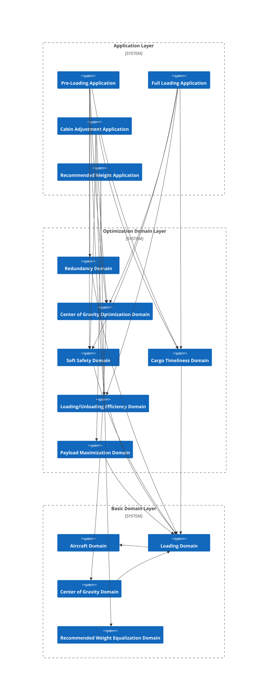

# Complex Example 2: Air Cargo Loading Planning Problem

## Problem Description

## Business Architecture

## Domain / Mathematical Model

### Loading Domain

#### Decision Variables

$x_{cp} \in \{0, 1\}$: Loading decision, dimensionless quantity, $1$ indicates placing cargo $c$ in compartment $p$.

$y_{p} \in \mathbb{R} - \mathbb{R}^{-}$: Estimated load weight, physical quantity is weight, represents the estimated load weight for compartment $p$.

$z_{p} \in \mathbb{N}$: Recommended load weight, physical quantity is weight, represents the recommended load weight for compartment $p$.

$u_{cp} \in \{-1, 0, 1\}$: Cabin adjustment decision, dimensionless quantity, $-1$ indicates removing cargo $c$ from compartment $p$, $1$ indicates placing cargo $c$ in compartment $p$.

#### Intermediate Values

##### Loading Decision

**Description**: For any cargo $c$ and any compartment $p$, the loading decision for whether this cargo is loaded into this compartment equals the sum of the loading decision and cabin adjustment decision.

$$
\text{Loaded}_{cp} = \begin{cases}
1,& c \in C^{\text{Loaded}}_{p} \\ \; \\
0,& c \notin C^{\text{Loaded}}_{p}
\end{cases}, \; \forall c \in C, \; \forall p \in P
$$

$$
\text{Stowage}_{cp} = \begin{cases}
x_{cp} + u_{cp} + \text{Loaded}_{cp}, & \forall c \in C^{SN}, \; \forall p \in P^{SN} \\ \; \\
\text{Loaded}_{cp},& \text{else}
\end{cases}
$$

##### Compartment Cargo Quantity

**Description**: For any compartment $p$, its compartment cargo quantity is the sum of the number of cargos loaded in that compartment.

$$
\text{LA}^{\text{Loaded}}_{p} = |C^{\text{Loaded}}_{p}|
$$

$$
\text{LA}^{\text{Estimate}}_{p} = \begin{cases}
\text{LA}^{\text{Loaded}}_{p},& \forall p \in (P - P^{SN}) \\ \; \\
\sum_{c \in C^{SN}} \text{Stowage}_{cp} + \text{LA}^{\text{Loaded}}_{p},& \forall p \in P^{SN}
\end{cases}
$$

##### Compartment Load Weight

**Description**: For any compartment $p$, its estimated compartment load weight is the sum of the weights of cargos loaded in that compartment, estimated load weight, and recommended load weight; its actual compartment load weight is the sum of the weights of cargos loaded in that compartment.

$$
\text{LW}^{\text{Loaded}}_{p} = \sum_{c \in C^{\text{Loaded}}_{p}} W_{c}
$$

$$
\text{LW}^{\text{Estimate}}_{p} = \begin{cases}
\text{LW}^{\text{Loaded}}_{p},& \forall p \in P^{\text{Unavailable}} \\ \; \\
\sum_{c \in C^{SN}} W_{c} \cdot \text{Stowage}_{cp} + y_{p} + \text{LW}^{\text{Loaded}}_{p},& \forall p \in P^{SN} \cap P^{PWN} \\ \; \\
\sum_{c \in C^{SN}} W_{c} \cdot \text{Stowage}_{cp} + z_{p} + \text{LW}^{\text{Loaded}}_{p},& \forall p \in P^{SN} \cap P^{RWN} \\ \; \\
\sum_{c \in C^{SN}} W_{c} \cdot \text{Stowage}_{cp} + \text{LW}^{\text{Loaded}}_{p},& \forall p \in P^{SN} - P^{PWN} - P^{RWN} \\ \; \\
y_{p} + \text{LW}^{\text{Loaded}}_{p},& \forall p \in P^{PWN} - P^{SN} \\ \; \\
z_{p} + \text{LW}^{\text{Loaded}}_{p},& \forall p \in P^{RWN} - P^{SN}
\end{cases}
$$

$$
\text{LW}^{\text{Actual}}_{p} = \begin{cases}
\text{LW}^{\text{Loaded}}_{p},& \forall p \in (P - P^{SN}) \\ \; \\
\sum_{c \in C^{SN}} W_{c} \cdot \text{Stowage}_{cp} + \text{LW}^{\text{Loaded}}_{p},& \forall p \in P^{SN}
\end{cases}
$$

##### Total Boarded Payload

**Description**: Total weight of currently boarded cargos.
$$
\text{Payload}^{\text{Boarded}} = \sum_{c \in C}W_{c}
$$

##### Estimated Payload

**Description**: Sum of current compartment calculated load weights.
$$
\text{Payload}^{\text{Estimate}}_{d} = \sum_{p \in P_{d}}\text{LW}^{\text{Estimate}}_{p}, \; \forall d \in D
$$

##### Actual Payload

**Description**: Sum of current compartment actual load weights.
$$
\text{Payload}^{\text{Actual}}_{d} = \sum_{p \in P_{d}}\text{LW}^{\text{Actual}}_{p}, \; \forall d \in D
$$

##### Computed Total Payload

**Description**: For pre-loading algorithm family, computed total payload uses estimated total payload; for full loading algorithm family, computed total payload uses real-time total payload.
$$
\text{Payload}^{\text{Computed}} = \begin{cases}
\text{Payload}^{\text{Plan}},& \text{Predistribution} \\ \; \\
\text{Payload}^{\text{Boarded}},& \text{FullLoad}
\end{cases}
$$

##### Estimated Total Payload

**Description**: Sum of current compartment calculated load weights.
$$
\text{Payload}^{\text{Estimate}} = \begin{cases}
\text{Payload}^{\text{Computed}},& \text{FullLoad \; \& \; Predistribution} \\ \; \\
\sum_{d \in D} \text{Payload}^{\text{Estimate}}_{d},& \text{otherwise}
\end{cases}
$$

##### Actual Total Payload

**Description**: Sum of current compartment actual load weights.

$$
\text{Payload}^{\text{Actual}} = \begin{cases}
\text{Payload}^{\text{Boarded}},& \text{FullLoad \; \& \; RecommendWeight} \\ \; \\
\sum_{d \in D} \text{Payload}^{\text{Actual}},& \text{otherwise}
\end{cases}
$$

### Center of Gravity Domain

### Airworthiness Safety Domain

### Center of Gravity Optimization Domain

### Soft Safety Domain

### Cargo Timeliness Domain

### Loading/Unloading Efficiency Domain

### Payload Maximization Domain

### Recommended Weight Equalization Domain

### Redundancy Domain

## Code Implementation

**Complete Implementation Reference:**

- [Kotlin](https://github.com/fuookami/ospf/tree/main/examples/ospf-kotlin-example/src/main/fuookami/ospf/kotlin/example/framework_demo/demo2)
