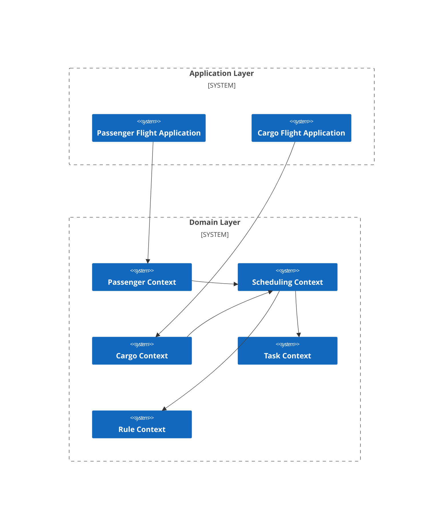

# Complex Example 4: Flight Recovery Problem

## Problem Description

## Business Architecture

## Mathematical Model

### RMP (Restricted Master Problem)

#### Scheduling Context

#### Passenger Context

#### Cargo Context

### SP (Subproblem)

## Code Implementation

**Complete Implementation Reference:**

- [Kotlin](https://github.com/fuookami/ospf/tree/main/examples/ospf-kotlin-example/src/main/fuookami/ospf/kotlin/example/framework_demo/demo4)
