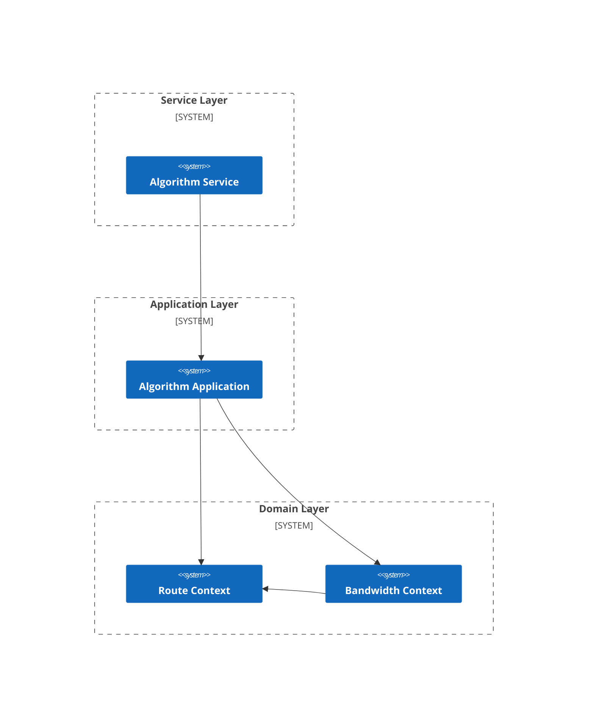
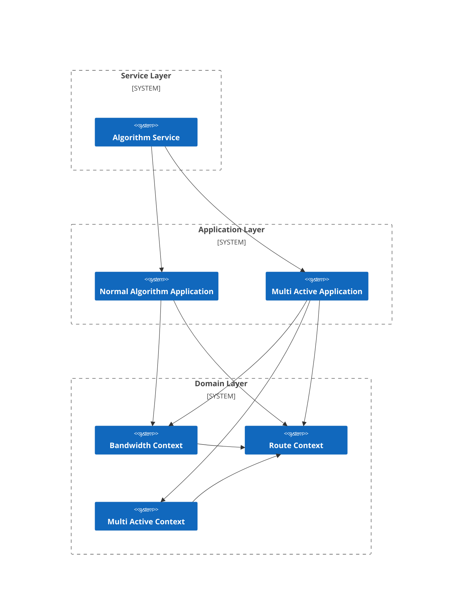

# What is ospf ?

ospf is a solution for the modeling and coding process in developing complex operational research algorithm software, along with its development components. It aims to provide a modeling approach based on <strong><em>Domain Driven Design</em></strong> (DDD), enabling users to efficiently develop and maintain mathematical models, solution algorithms, and their implementation code throughout the entire software lifecycle.

The implementation for each host language can be found in the following code repository directories:

- C++：https://github.com/fuookami/ospf-cpp
- C#：https://github.com/fuookami/ospf-csharp
- Kotlin：https://github.com/fuookami/ospf-kotlin
- Python：https://github.com/fuookami/ospf-python
- Rust：https://github.com/fuookami/ospf-rust

## Prologue

When building complex systems, software engineers intentionally or unintentionally apply numerous cognitive models. It is precisely these effective cognitive models that enable us to construct today's highly intricate information systems, ushering us into the era of digital intelligence. These cognitive models include, but are not limited to: abstraction, layering, divide-and-conquer, evolution, protocols, and more. They are now ubiquitous in the architectural design of our various information systems.

During the execution of cognitive tasks, we inevitably need to temporarily store and process information, a process that engages what cognitive psychology refers to as working memory —— the central hub of human cognition. However, working memory has its limits; in other words, there is a cap on the number of things we can process simultaneously. It is generally believed that we can handle up to four "chunks" at a time. These "chunks" can be numbers, letters, words, or other forms. Yet, once we master a mathematical or scientific technique, or a certain concept, the space it occupies in working memory shrinks. The freed-up mental capacity then allows us to more easily handle other ideas.

So, how is abstraction applied in our software architecture design? Simply put, abstraction involves assembling basic elements into a composite element and then using that composite element directly. Below, we can see three code snippets that express the same semantic meaning—comparing the sizes of two rectangles—with progressively increasing levels of abstraction.

<b>Procedure Oriented 1</b>:
```rust
fn main() {
    let length1: f64 = 10.;
    let width1: f64 = 8.;
    let area1 = length1 * width1;
    let length2: f64 = 11.;
    let width2: f64 = 7.;
    let area2 = length2 * width2;
    assert (area1 > area2);
}
```

<b>Procedure Oriented 2</b>:
```rust
fn area(length: f64, width: f64) -> f64 {
    length * width
}

fn bigger_than(length1: f64, width1: f64, length2: f64, width: f64) -> bool {
    area(length1, width1) > area(length2, width2)
}

fn main() {
    let length1: f64 = 10.;
    let width1: f64 = 8.;
    let length2: f64 = 11.;
    let width2: f64 = 7.;
    assert (bigger_than(length1, width1, length2, width2));
}
```

<b>Object Oriented</b>
```rust
struct Rectangle {
    length: f64,
    width: f64
}

impl Rectangle {
    fn new(l: f64, w: f64) -> Self {
        Self {
            length: l,
            width: w
        }
    }

    fn area(&self) -> f64 {
        self.length * self.width
    }

    fn bigger_than(&self, rhs: &Self) -> bool {
        self.area() > rhs.area()
    }
}

fn main() {
    let r1 = Rectangle::new(10., 8.);
    let r2 = Rectangle::new(11., 7.);
    assert (r1.bigger_than(&r2));
}
```

The first segment has no abstraction at all. The second segment abstracts the computational process and then utilizes these processes, which we generally refer to as <b>Procedural-Oriented</b>. The third segment abstracts both the concept of a rectangle and the computational processes around it, then employs this concept and these processes, which we generally call <b>Object-Oriented</b>.

As the level of abstraction increases, we can easily observe that the amount of code in the main function gradually decreases while the semantic clarity improves. Even though the final segment has the largest actual code volume, in modern practice, nearly all programmers adopt the third approach. Since compilers can translate it into the same machine code, developers naturally prefer a more human-readable coding style.

Traditional operations research algorithm development lacks such abstraction methods. Without abstraction, product engineers and algorithm engineers, or even algorithm engineers among themselves, struggle to communicate effectively due to the absence of a unified common language. Moreover, without applying software architecture design techniques in practice, the implementation code of mathematical models becomes difficult to reuse. In large-scale OR algorithm development, this leads to significant wasted effort on repetitive tasks. Additionally, the coding style of mathematical model implementations tends to be heavily influenced by individual algorithm engineers, making collaboration between them challenging.

## Intermediate Expression

ospf introduces a concept called "intermediate expression" to facilitate DDD-based modeling. Intermediate expressions are used in mathematical models to represent intermediate results of computations, aiming to simplify the representation of the model and make it easier to understand and maintain. Intermediate expressions possess the following characteristics:

- they refer to named polynomials that are stored.
- they are semantically equivalent to anonymous polynomials.
- they are grammatically equivalent to variables, having a global scope and static lifetime.
- they can be constructed through an anonymous polynomial.

### Arithmetic Intermediate Expression:

The initial purpose of designing intermediate expressions was to reduce redundancy in mathematical models. Therefore, the most basic arithmetic intermediate expressions are constructed using a polynomial, allowing users to replace all identical polynomials with this intermediate expression anywhere in the model.

$$
ExprSymbol = \sum_{i} x_{i}
$$

$$
min \quad ExprSymbol
$$

$$
s.t. \quad ExprSymbol \leq 1
$$

ospf automatically replaces each arithmetic intermediate expressions with specific polynomials when translating the model into interfaces for specific solvers. This translation process is transparent to the user, so the user does not need to know how the arithmetic intermediate expressions are implemented through which variables and operations.

Thus, we can divide the maintainers of mathematical models into two roles: <em>"intermediate expressions maintainer"</em> and <em>"user of intermediate expressions"</em>. The intermediate expressions maintainers are responsible for defining and implementing intermediate expressions, while users of intermediate expressions do not concern themselves with the implementation of intermediate expresssions. They only focus on the definition and behavior of intermediate expressions and use these intermediate expressions to describe business logic in mathematical models.

This engineering practice is similar to <strong><em>Object-Oriented Design</em></strong> (OOD), where defining a class encapsulates variables and functions with the same semantics, and users only need to focus on their behavior without concerning themselves with their implementation. With such a foundation, we can then begin to introduce DDD.

### Functional Intermediate Expression:

Building upon the concept of arithmetic intermediate expressions, ospf can also encapsulate non-arithmetic expressions such as logical operations into intermediate expressions.

$$
FuncSymbol = \bigvee_{i} x_{i} = Or(x_{1}, \, x_{2}, \, .. \, , \, x_{i})
$$

$$
s.t. \quad FuncSymbol = 1
$$

When ospf translates the model into interfaces for specific solvers, it automatically adds the intermediate variables and constraints required for each intermediate expressions. This translation process is transparent to the users, so the users don't need to know how the intermediate expressions are implemented through which intermediate variables and constraints. For example, the expression $FuncSymbol = \bigvee_{i} x_{i}$ will be translated as follows:

$$
s.t. \quad y = 1
$$

$$
\begin{cases}
  y \geq \frac{x_{i}}{\sup_{\leq}(x_{i})}, & \sup_{\leq}(x_{i}) > 1 \\\\\\
  y \geq x_{i}, & else
\end{cases}
$$

$$
y \leq \sum_{i} x_{i}
$$

$$
y \in \\{ 0, 1 \\}
$$

Of course, you can also extend these intermediate expressions according to your own business requirements. At this point, you need to implement some interfaces to let ospf know which intermediate variables and constraints need to be added for these intermediate expressions.

The <em>ospf-core</em> only maintains arithmetic and logical functions. In fact, we can design and implement functional intermediate expressions based entirely on the domain, as part of domain engineering. For specific references, you can refer to the development package for specific problem domains in the <em>ospf-framework</em>.

## Changes when Modeling with ospf

### Problem Description

In a given telecommunications network structure, in order to deliver video content to each residential area quickly and at low cost, it is necessary to place video content storage servers near selected network nodes within this predefined network architecture.

<div align="center">
  
</div>

It is now known that:
1. Each link has a bandwidth $Bandwidth^{Max}$ and bandwidth cost $Cost^{Bandwidth}$ ;
2. Each server has a capacity $Capacity$ and service cost $Cost^{Service}$ ;
3. Each consumer node has a demand $Demand$ .

Determine the placement locations of video content storage servers and the bandwidth links to minimize server usage costs and link usage costs, while satisfying the following conditions:
1. At most one server can be deployed at each node;
2. Each server can be deployed to at most one node;
3. All residential area video playback demands must be met;
4. The traffic at transit nodes must be balanced.

### Tranditional Modeling

#### Sets

$N$: set of nodes.

$N^{N}$: set of normal (non-consumer) nodes.

$N^{C}$: set of consumer nodes.

$S$: set of services.

$E$: set of links.

#### Constants

$Cost^{Service}_{s}$: service cost of service $s$.

$Cost^{Bandwidth}_{e_{ij}}$: bandwidth cost of link between node $i$ and node $j$.

$Bandwidth^{Max}_{e_{ij}}$: maximum bandwidth of link between node $i$ and node $j$.

$Capacity_{s}$: capacity of server $s$.

$Demand_{i}$: bandwidth demand of node $i$.

#### Variables

$x_{is}$: whether server $s$ is deployed on node $i$.

$y_{e_{ij}, s}$: whether link $e_{ij}$ is used by server $s$.

#### Objective Function

$$
\begin{align} Min \quad
& \sum_{s \in S} Cost^{Service}_{s} \cdot \sum_{i \in N^{N}} x_{is} \tag{1} \\
& + \sum_{i \in N^{N}}\sum_{j \in N^{N}} Cost^{Bandwidth}_{e_{ij}} \cdot \sum_{s \in S} y_{e_{ij}, s} \tag{2}
\end{align}
$$

Here, $(1)$ represents the server usage cost, and $(2)$ represents the bandwidth usage cost.

#### Constraints

$$
\begin{align}
s.t. \quad & \sum_{s \in S} x_{is} \leq 1, & \; \forall i \in N^{N} \tag{3} \\
& \sum_{i \in N^{N}} x_{is} \leq 1, & \; \forall s \in S \tag{4} \\
& y_{e_{ij}, s} \leq Bandwidth^{Max}_{e_{ij}} \cdot \sum_{i \in N^{N}} x_{is}, & \; \forall i \in N^{N}, \; \forall j \in N, \; \forall s \in S \tag{5} \\
& \sum_{s \in S}\sum_{i \in N^{N}} y_{e_{ij}, s} \geq Demand_{i}, & \; \forall j \in N^{C} \tag{6} \\
& \sum_{j \in N} y_{e_{ij}, s} - \sum_{j \in N^{N}} y_{e_{ji}, s} \leq \sum_{j \in N} Bandwidth^{Max}_{e_{ij}} \cdot \sum_{s \in S} x_{js}, & \; \forall i \in N^{N} \tag{7} \\
& \sum_{j \in N} y_{e_{ij}, s} - \sum_{j \in N^{N}} y_{e_{ji}, s} \leq Capacity_{s} \cdot x_{is}, & \; \forall i \in N^{N}, \; \forall s \in S \tag{8} \\
& x_{is} \in \{0, 1\}, & \; \forall i \in N^{N}, \; \forall s \in S \tag{9} \\
& y_{e_{ij}, s} \in R^{\ast}, & \; \forall i \in N^{N}, \; \forall j \in N, \; \forall s \in S \tag{10}
\end{align}
$$

Here, $(3)$ ensures that at most one server can be deployed on each node, $(4)$ restricts each server to be deployed on at most one node, $(5)$ constrains the bandwidth usage of each link not to exceed its maximum capacity and ensures that only servers can consume bandwidth, $(6)$ enforces the satisfaction of consumer node demands, $(7)$ imposes flow balance constraints on transit nodes, $(8)$ limits the net output of server nodes to their capacity, and $(9)$ and $(10)$ define the feasible ranges of the variables.

### Modeling with ospf: Abstract and Encapsulate Duplicate Parts Using Intermediate Expression

#### Overview

The design method for mathematical models based on large-scale reuse is essentially an approach that abstracts and modularizes mathematical models using intermediate values. The intermediate values extracted within each bounded context serve as the interfaces for that context, which other contexts can then utilize.

In this problem, we can easily identify two interdependent business domains: route and bandwidth. The route domain describes whether a server is in use and, if so, where it is deployed. The bandwidth domain builds upon the route domain, describing the bandwidth occupied on each link given such a deployment of server clusters. We will proceed with mathematical modeling based on this bounded context partitioning approach.

#### Route Domain

##### Variables

$x_{is} \in \{0, 1\}$: whether server $s$ is deployed on node $i$.

##### Intermediate Expressions

###### 1. Whether Any Server is Deployed on Node

$$
Assignment^{Node}_{i} = \sum_{s \in S} x_{is}, \; \forall i \in N^{N}
$$

###### 2. Whether Server is Deployed on Any Node

$$
Assignment^{Server}_{s} = \sum_{i \in N^{N}} x_{is}, \; \forall s \in S
$$

##### Objective Function

###### 1. Minimize Server Cost

**Description**: Minimize the total cost of deploying servers on nodes.

$$
min \quad \sum_{s \in S} Cost^{Service}_{s} \cdot Assignment^{Service}_{s}
$$

##### Constraints

###### 1. Node Deployment Limit

**Description**: At most one server can be deployed on each node.

$$
s.t. \quad Assignment^{Node}_{i} \leq 1, \; \forall i \in N^{N}
$$

###### 2. Server Deployment Limit

**Description**: Each server can be deployed to at most one node.

$$
s.t. \quad Assignment^{Server}_{s} \leq 1, \; \forall s \in S
$$

#### Bandwidth Domain

##### Variables

$y_{e_{ij}, s} \in R^{\ast}$: whether link $e_{ij}$ is used by server $s$.

##### Intermediate Expressions

###### 1. Bandwidth Usage

$$
Bandwidth_{e_{ij}} = \sum_{s \in S} y_{e_{ij}, s}, \; \forall i \in N^{N}, \; \forall j \in N
$$

###### 2. Indegree Bandwidth

$$
Bandwidth^{Indegree, Service}_{js} = \sum_{i \in N^{N}} y_{e_{ij}, s}, \; \forall j \in N, \; \forall s \in S
$$

$$
Bandwidth^{Indegree, Node}_{j} = \sum_{s \in S} Bandwidth^{Indegree, Service}_{js}, \; \forall j \in N
$$

###### 3. Outdegree Bandwidth

$$
Bandwidth^{Outdegree, Service}_{is} = \sum_{j \in N} y_{e_{ij}, s}, \; \forall i \in N^{N}, \; \forall s \in S
$$

$$
Bandwidth^{Outdegree, Node}_{i} = \sum_{s \in S} Bandwidth^{Outdegree, Service}_{js}, \; \forall i \in N^{N}
$$

###### 4. OutFlow Bandwidth

$$
Bandwidth^{OutFlow, Service}_{is} = Bandwidth^{Outdegree, Service}_{is} - Bandwidth^{Indegree, Service}_{is}, \; \forall i \in N^{N}, \; \forall s \in S
$$

$$
Bandwidth^{OutFlow, Node}_{i} = \sum_{s \in S} Bandwidth^{OutFlow, Service}_{is}, \; \forall i \in N^{N}
$$

##### Objective Function

###### 1. Minimize Bandwidth Usage Cost

**Description**: Minimize the total cost of using bandwidth on links.

$$
min \quad \sum_{i \in N^{N}}\sum_{j \in N^{N}} Cost^{Bandwidth}_{e_{ij}} \cdot Bandwidth_{e_{ij}}
$$

##### Constraints

###### 1. Bandwidth Usage Limit

**Description**: The bandwidth usage of each link not to exceed its maximum capacity and ensures that only servers can consume bandwidth.

$$
s.t. \quad y_{e_{ij}, s} \leq Bandwidth^{Max}_{e_{ij}} \cdot Assignment^{Service}_{s}, \; \forall i \in N^{N}, \; \forall j \in N, \; \forall s \in S
$$

###### 2. Demand Satisfaction Limit

**Description**: Enforce the satisfaction of consumer node demands.

$$
s.t. \quad \sum_{s \in S} Bandwidth^{OutFlow, Service}_{is} \geq Demand_{i}, \; \forall i \in N^{C}
$$

###### 3. Flow Balance Limit

**Description**: Impose flow balance constraints on transit nodes.

$$
s.t. \quad \sum_{j \in N} y_{e_{ij}, s} - \sum_{j \in N^{N}} y_{e_{ji}, s} \leq \sum_{j \in N} Bandwidth^{Max}_{e_{ij}} \cdot Assignment^{Service}_{s}, \; \forall i \in N^{N}, \; \forall s \in S
$$

###### 4. Server Capacity Limit

**Description**: Limit the outflow of server nodes to their capacity.

$$
s.t. \quad \sum_{j \in N} y_{e_{ij}, s} - \sum_{j \in N^{N}} y_{e_{ji}, s} \leq Capacity_{s} \cdot Assignment^{Service}_{s}, \; \forall i \in N^{N}, \; \forall s \in S
$$

#### Code Implementation

Code implementation refers to [example page](/examples/framework-example1#code-implementation)

#### Business Architecture and Integration Architecture

The mathematical model design method based on large-scale reuse divides the model into two bounded contexts: route and bandwidth, effectively splitting the monolithic server placement business into these two distinct themes. The final delivered algorithmic application is responsible for integrating these two parts to provide a complete algorithmic service. This process is generally referred to as <b> mapping the problem space to the solution space</b>. A key characteristic of this approach is that the domain layer and application layer of the integration architecture align structurally with the business architecture.



If we also have different users with multi-active requirements on top of these foundational services, we can similarly decouple the multi-active logic and implement it as a multi-active bounded context. By constructing an application that integrates route context, bandwidth context, and multi-active context, we can deliver a multi-active-aware solution relatively quickly -- leveraging the existing route and bandwidth contexts instead of reimplementing them from scratch.



More broadly, if we carefully plan and implement the bounded contexts in the domain layer to construct an operations research mathematical model librar -- akin to a knowledge bas -- we can then integrate these bounded contexts to rapidly deliver the algorithmic applications users require. The process of building these library components is generally referred to as <b> domain engineering </b>.

## Components

ospf is designed and implemented using an internal <strong><em>Domain Specific Language</em></strong> (DSL) format. Apart from some shared components, the rest are implemented in the target host language.

### Shared Components

- <strong>[examples](https://github.com/fuookami/ospf/tree/main/examples)</strong>: examples demonstrating how to use ospf for modeling and solving.

- <strong>[framework](https://github.com/fuookami/ospf/tree/main/framework)</strong>: a set of common components developed for specific problem domains, including visualization tools for results.

- <strong>[remote](https://github.com/fuookami/ospf/tree/main/remote)</strong>: a remote solver scheduler and server used to execute solvers on a server and retrieve results through a network interface.

### Components In Host Language Implementation 

each ospf implementation consists of the following components:

- <strong>utils</strong>: utilities containing classes and functions required for implementing ospf DSL.
- <strong>core</strong>: core components containing essential functionalities such as modeling, solver interfaces, result processing, etc.
  - <strong>core-plugin-XXX</strong>: solver plugins implementing solver interfaces for specific solvers.
  - <strong>core-plugin-heuristic</strong>: meta-heuristic algorithm plugins containing implementations of various common meta-heuristic algorithms.
- <strong>framework</strong>: problem-specific frameworks containing implementations of data processing, mathematical models, and solving algorithms tailored to specific problems. All designs and implementations are non-intrusive, allowing users to use them out of the box or extend them seamlessly, integrating with other frameworks or components.
  - <strong>framework-plugin-XXX</strong>: framework plugins implementing functionalities requiring middleware involvement, such as data persistence, asynchronous message communication.
  - <strong>bpp1d</strong>: 1D <strong><em>Bin Packing Problem</em></strong> (BPP) development package containing implementations of data processing, mathematical models, and solving algorithms for various 1D BPPs.
  - <strong>bpp2d</strong>: 2D <strong><em>Bin Packing Problem</em></strong> (BPP) development package containing implementations of data processing, mathematical models, and solving algorithms for various 2D BPPs.
  - <strong>bpp3d</strong>: 3D <strong><em>Bin Packing Problem</em></strong> (BPP) development package containing implementations of data processing, mathematical models, and solving algorithms for various 3D BPPs.
  - <strong>csp1d</strong>: 1D <strong><em>Cutting Stock Problem</em></strong> (CSP) development package containing implementations of data processing, mathematical models, and solving algorithms for various 1D CSPs.
  - <strong>csp2d</strong>: 2D <strong><em>Cutting Stock Problem</em></strong> (CSP) development package containing implementations of data processing, mathematical models, and solving algorithms for various 2D CSPs.
  - <strong>gantt-scheduling</strong>: gantt scheduling problem development package containing implementations of data processing, mathematical models, and solving algorithms for various Gantt chart scheduling problems. It can be used for scheduling and planning problems such as <strong><em>Advanced Production Scheduling</em></strong> (APS), <strong><em>Lot Scheduling Problem</em></strong> (LSP), etc.
  - <strong>network-scheduling</strong>: network scheduling problem development package containing implementations of data processing, mathematical models, and solving algorithms for various network scheduling problems. It can be used for scheduling and planning problems such as <strong><em>Vehicle Routing Problem</em></strong> (VRP), <strong><em>Facility Location Problem</em></strong> (FLP), etc.

## Features And Progress

- ✔️：Stable version.
- ⭕：Development completed, unstable version.
- ❗：Under development, incomplete version.
- ❌：Planned, not started.

### Core

<div style="width: auto; display: table; margin-left: auto; margin-right: auto;">
  <table style="text-align: center;">
    <thead>
      <tr>
        <th>Feature</th>
        <th>C++</th>
        <th>C#</th>
        <th>Kotlin</th>
        <th>Python</th>
        <th>Rust</th>
      </tr>
    </thead>
    <tbody>
      <tr>
        <td colspan=6>Modeling Language</td>
      </tr>
      <tr>
        <td>MILP</td>
        <td>❗</td>
        <td>❌</td>
        <td>✔️</td>
        <td>❌</td>
        <td>❗</td>
      </tr>
      <tr>
        <td>MIQCQP</td>
        <td>❌</td>
        <td>❌</td>
        <td>✔️</td>
        <td>❌</td>
        <td>❌</td>
      </tr>
      <tr>
        <td>MINLP</td>
        <td>❌</td>
        <td>❌</td>
        <td>❌</td>
        <td>❌</td>
        <td>❌</td>
      </tr>
      <tr>
        <td colspan=6>Solver Wrapper</td>
      </tr>
      <tr>
        <td>COPIN-OR</td>
        <td>❗</td>
        <td>❌</td>
        <td>❗</td>
        <td>❌</td>
        <td>❗</td>
      </tr>
      <tr>
        <td>COPT</td>
        <td>❌</td>
        <td>❌</td>
        <td>✔️</td>
        <td>❌</td>
        <td>❌</td>
      </tr>
      <tr>
        <td>CPLEX</td>
        <td>❗</td>
        <td>❌</td>
        <td>✔️</td>
        <td>❌</td>
        <td>❗</td>
      </tr>
      <tr>
        <td>GUROBI</td>
        <td>❗</td>
        <td>❌</td>
        <td>✔️</td>
        <td>❌</td>
        <td>❗</td>
      </tr>
      <tr>
        <td>GUROBI-11</td>
        <td>❗</td>
        <td>❌</td>
        <td>✔️</td>
        <td>❌</td>
        <td>❗</td>
      </tr>
      <tr>
        <td>HEXALY</td>
        <td>❗</td>
        <td>❌</td>
        <td>✔️</td>
        <td>❌</td>
        <td>❗</td>
      </tr>
      <tr>
        <td>LINGO</td>
        <td>❗</td>
        <td>❌</td>
        <td>❗</td>
        <td>❌</td>
        <td>❗</td>
      </tr>
      <tr>
        <td>MINDOPT</td>
        <td>❗</td>
        <td>❌</td>
        <td>✔️</td>
        <td>❌</td>
        <td>❗</td>
      </tr>
      <tr>
        <td>MOSEK</td>
        <td>❗</td>
        <td>❌</td>
        <td>✔️</td>
        <td>❌</td>
        <td>❗</td>
      </tr>
      <tr>
        <td>OPTVERSE</td>
        <td>❗</td>
        <td>❌</td>
        <td>❗</td>
        <td>❌</td>
        <td>❗</td>
      </tr>
      <tr>
        <td>SCIP</td>
        <td>❗</td>
        <td>❌</td>
        <td>✔️</td>
        <td>❌</td>
        <td>❗</td>
      </tr>
      <tr>
        <td>else</td>
        <td colspan=5>planing</td>
      </tr>
      <tr>
        <td colspan=6>Meta-Heuristic Algorithm</td>
      </tr>
      <tr>
        <td>PSO</td>
        <td>❗</td>
        <td>❌</td>
        <td>✔️</td>
        <td>❌</td>
        <td>❗</td>
      </tr>
      <tr>
        <td>GA</td>
        <td>❗</td>
        <td>❌</td>
        <td>✔️</td>
        <td>❌</td>
        <td>❗</td>
      </tr>
      <tr>
        <td>MVO</td>
        <td>❗</td>
        <td>❌</td>
        <td>✔️</td>
        <td>❌</td>
        <td>❗</td>
      </tr>
      <tr>
        <td>SAA</td>
        <td>❗</td>
        <td>❌</td>
        <td>✔️</td>
        <td>❌</td>
        <td>❗</td>
      </tr>
      <tr>
        <td>HCA</td>
        <td>❗</td>
        <td>❌</td>
        <td>❗</td>
        <td>❌</td>
        <td>❗</td>
      </tr>
      <tr>
        <td>NMS</td>
        <td>❗</td>
        <td>❌</td>
        <td>❗</td>
        <td>❌</td>
        <td>❗</td>
      </tr>
      <tr>
        <td>else</td>
        <td colspan=5>planing</td>
      </tr>
    </tbody>
  </table>
</div>

### Framework

<div style="width: auto; display: table; margin-left: auto; margin-right: auto;">
  <table style="text-align: center;">
    <thead>
      <tr>
        <th>Feature</th>
        <th>C++</th>
        <th>C#</th>
        <th>Kotlin</th>
        <th>Python</th>
        <th>Rust</th>
        <th>Visualization</th>
      </tr>
    </thead>
    <tbody>
      <tr>
        <td>Basic Framework</td>
        <td>❗</td>
        <td>❌</td>
        <td>✔️</td>
        <td>❌</td>
        <td>❗</td>
        <td></td>
      </tr>
      <tr>
        <td>bpp1d</td>
        <td>❌</td>
        <td>❌</td>
        <td>❌</td>
        <td>❌</td>
        <td>❌</td>
        <td>❌</td>
      </tr>
      <tr>
        <td>bpp2d</td>
        <td>❌</td>
        <td>❌</td>
        <td>❌</td>
        <td>❌</td>
        <td>❌</td>
        <td>❌</td>
      </tr>
      <tr>
        <td>bpp3d</td>
        <td>❌</td>
        <td>❌</td>
        <td>✔️</td>
        <td>❌</td>
        <td>❌</td>
        <td>✔️</td>
      </tr>
      <tr>
        <td>csp1d</td>
        <td>❌</td>
        <td>❌</td>
        <td>⭕</td>
        <td>❌</td>
        <td>❌</td>
        <td>✔️</td>
      </tr>
      <tr>
        <td>csp2d</td>
        <td>❌</td>
        <td>❌</td>
        <td>❌</td>
        <td>❌</td>
        <td>❌</td>
        <td>❌</td>
      </tr>
      <tr>
        <td>gantt-scheduling</td>
        <td>❌</td>
        <td>❌</td>
        <td>✔️</td>
        <td>❌</td>
        <td>❌</td>
        <td>✔️</td>
      </tr>
      <tr>
        <td>network-scheduling</td>
        <td>❌</td>
        <td>❌</td>
        <td>❌</td>
        <td>❌</td>
        <td>❌</td>
        <td>❌</td>
      </tr>
      <tr>
        <td>else</td>
        <td colspan=6>planing</td>
      </tr>
    </tbody>
  </table>
</div>

### Remote

<div style="width: auto; display: table; margin-left: auto; margin-right: auto;">
  <table style="text-align: center;">
    <thead>
      <tr>
        <th>Feature</th>
        <th></th>
      </tr>
    </thead>
    <tbody>
      <tr>
        <td>Solver Serivce</td>
        <td>❗</td>
      </tr>
      <tr>
        <td>Meta-Heuristic Algorithm Service</td>
        <td>❌</td>
      </tr>
      <tr>
        <td>Dispatcher</td>
        <td>❗</td>
      </tr>
      <tr>
        <td>Time Slice Cycle</td>
        <td>❌</td>
      </tr>
    </tbody>
  </table>
</div>
