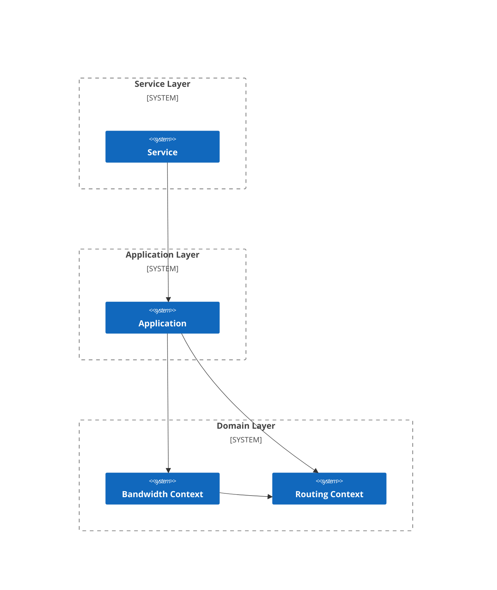
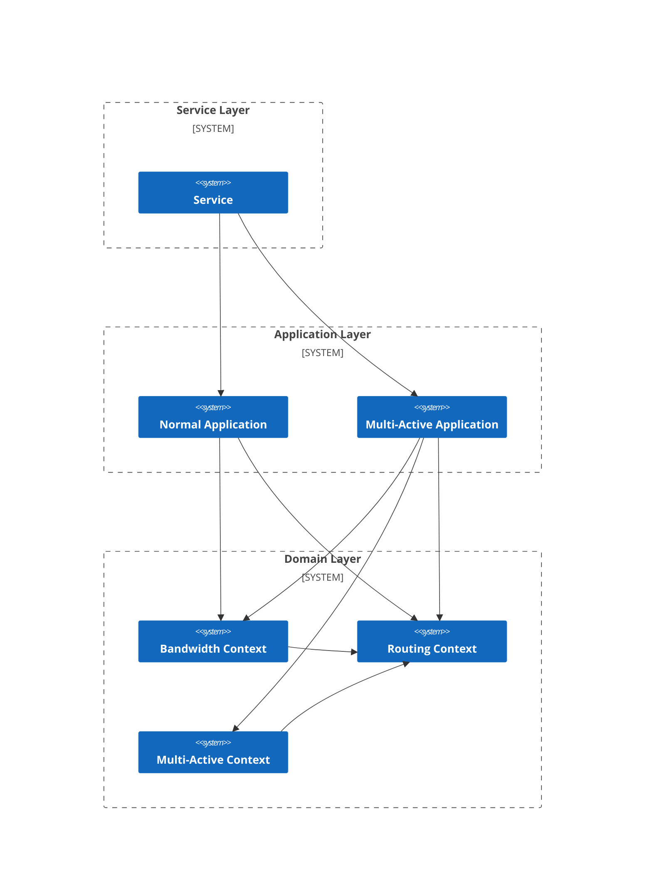

# What is OSPF?

OSPF is a solution and development component for modeling and coding processes in complex operations research optimization algorithms. OSPF aims to provide a modeling approach based on **Domain-Driven Design (DDD)**, enabling users to simply and efficiently develop and maintain mathematical models, solution algorithms, and their implementation code throughout the entire software lifecycle.

Implementations for various host languages can be found in the following code repository directories:

- C++: https://github.com/fuookami/ospf-cpp
- C#: https://github.com/fuookami/ospf-csharp
- Kotlin: https://github.com/fuookami/ospf-kotlin
- Python: https://github.com/fuookami/ospf-python
- Rust: https://github.com/fuookami/ospf-rust

## Introduction

When software engineers build complex systems, they consciously or unconsciously apply numerous cognitive models. It is these effective cognitive models that help us construct today's incredibly complex information systems, ushering us into the digital intelligence era. These cognitive models include but are not limited to: abstraction, layering, divide and conquer, evolution, protocols, etc., which are already pervasive in the architectural design of our various information systems.

During the execution of cognitive tasks, we certainly need to temporarily store and process information resources. This process utilizes what cognitive psychology calls working memory, the human cognitive center. However, working memory has capacity limitations, meaning we can only simultaneously cognize a limited number of things, generally considered to be at most 4 "chunks". These "chunks" can be numbers, letters, words, or other forms. However, if we master a mathematical or scientific technique, or a concept, it occupies less space in working memory. The freed brain space then allows us to more easily handle other ideas.

So how is abstraction applied to our software structure design? Simply put, abstraction is assembling some basic elements into a composite element, then directly using that composite element. We can see the following three code segments, which express the same semantics: comparing the area sizes of two rectangles. Their abstraction level gradually increases.

**Procedural 1**:
```rust
fn main() {
    let length1: f64 = 10.;
    let width1: f64 = 8.;
    let area1 = length1 * width1;
    let length2: f64 = 11.;
    let width2: f64 = 7.;
    let area2 = length2 * width2;
    assert (area1 > area2);
}
```

**Procedural 2**:
```rust
fn area(length: f64, width: f64) -> f64 {
    length * width
}

fn bigger_than(length1: f64, width1: f64, length2: f64, width: f64) -> bool {
    area(length1, width1) > area(length2, width2)
}

fn main() {
    let length1: f64 = 10.;
    let width1: f64 = 8.;
    let length2: f64 = 11.;
    let width2: f64 = 7.;
    assert (bigger_than(length1, width1, length2, width2));
}
```

**Object-Oriented**:
```rust
struct Rectangle {
    length: f64,
    width: f64
}

impl Rectangle {
    fn new(l: f64, w: f64) -> Self {
        Self {
            length: l,
            width: w
        }
    }

    fn area(&self) -> f64 {
        self.length * self.width
    }

    fn bigger_than(&self, rhs: &Self) -> bool {
        self.area() > rhs.area()
    }
}

fn main() {
    let r1 = Rectangle::new(10., 8.);
    let r2 = Rectangle::new(11., 7.);
    assert (r1.bigger_than(&r2));
}
```

The first segment has no abstraction at all. The second segment abstracts the computation process and then uses these computation processes, which we generally call procedural programming. The third segment abstracts both the concept of a rectangle and the computation processes around rectangles, then uses this concept and these computation processes, which we generally call object-oriented programming.

As the abstraction level increases, we can easily see that the code volume in the main function gradually decreases, and the semantic level gradually improves. Even though the actual code volume of the last segment is the largest, in modern times, essentially all programmers would use the writing style of the third segment. We can rely on the compiler to translate it into the same machine code, so naturally, during the coding process, we would choose a more human-oriented writing style.

Traditional operations research algorithm development lacks abstraction methods. The lack of abstraction methods leads to poor communication between product engineers and algorithm engineers, and between algorithm engineers themselves, due to the absence of a unified common language. Simultaneously, because various software structure design techniques cannot be applied in development practice, the implementation code of mathematical models is difficult to reuse. In large-scale operations research algorithm development, significant human-hours are consumed in repetitive work. Additionally, the code style of mathematical model implementation code is heavily influenced by individual algorithm engineers, making collaboration between algorithm engineers difficult.

## Intermediate Values

OSPF provides a concept named "Intermediate Values" to implement DDD-based modeling. Intermediate values in mathematical models represent intermediate results of operations, helping to simplify model representation and make models easier to understand and maintain. Intermediate values have the following characteristics:

- Refer to a stored, named expression
- Semantically equivalent to anonymous expressions
- Grammatically equivalent to variables, with global scope and static lifetime

### Arithmetic Intermediate Values

The initial design purpose of intermediate values was to reduce duplication in mathematical models, so the most basic arithmetic intermediate values are constructed through a polynomial. Users can then use this intermediate value anywhere in the model to replace all identical polynomials.

$$
\text{ExprSymbol} = \sum_{i} x_{i}
$$

$$
\min \quad \text{ExprSymbol}
$$

$$
\text{s.t.} \quad \text{ExprSymbol} \leq 1
$$

OSPF automatically replaces each arithmetic intermediate value with the specific polynomial when translating the model to the specific solver interface. This translation process is transparent to users, so users do not need to know how this arithmetic intermediate value is implemented through which variables and operations.

Thus, we can divide mathematical model maintainers into two roles: "Intermediate Value Maintainers" and "Mathematical Model Maintainers Using Intermediate Values". Intermediate value maintainers are responsible for defining and implementing intermediate values. Mathematical model maintainers using intermediate values do not focus on the implementation of intermediate values, only on their definition and behavior, and use these intermediate values to describe business logic in mathematical models.

This engineering practice is the same as defining a class in Object-Oriented Design (OOD) to encapsulate variables and functions with the same semantics, where users only need to focus on its behavior, not its implementation. With this foundation, we can begin introducing DDD.

### Functional Intermediate Values

Based on the concept of arithmetic intermediate values, OSPF can similarly encapsulate non-arithmetic expressions like logical operation expressions into intermediate values.

$$
\text{FuncSymbol} = \bigvee_{i} x_{i} = \text{Or}(x_{1}, \, x_{2}, \, .. \, , \, x_{i})
$$

$$
\text{s.t.} \quad \text{FuncSymbol} = 1
$$

OSPF automatically adds the required intermediate variables and constraints for each functional intermediate value when translating the model to the specific solver interface. This translation process is transparent to users, so users do not need to know how this functional intermediate value is implemented through which intermediate variables and constraints. For example, the above $\text{FuncSymbol} = \bigvee_{i} x_{i}$ would be translated to:

$$
\text{s.t.} \quad y = 1
$$

$$
\begin{cases}
  y \geq \frac{x_{i}}{\max(x_{i})}, & \max(x_{i}) > 1 \\ \; \\
  y \geq x_{i}, & \text{else}
\end{cases}
$$

$$
y \leq \sum_{i} x_{i}
$$

$$
y \in \{ 0, 1 \}
$$

Of course, you can also extend these functional intermediate values based on your business needs. At this point, you need to implement some interfaces to let OSPF know which intermediate variables and constraints this functional intermediate value requires.

OSPF-core itself only maintains arithmetic operators and logical operators. In fact, we can completely design and implement functional intermediate values based on domains as part of domain engineering. For specifics, refer to the development packages for specific problems in ospf-framework.

## Changes in Modeling with OSPF

### Problem Description

In a given telecommunications network structure, to quickly and cost-effectively deliver video content to each residential area, video content storage servers need to be placed near some network nodes in this given network structure.

<div align="center">
  
</div>

Currently known:
1. Each link has bandwidth $Bandwidth^{Max}$ and bandwidth cost $Cost^{Bandwidth}$;
2. Each server has load capacity $Capacity$ and usage cost $Cost^{Service}$;
3. Each consumer node has demand $Demand$.

Determine the placement locations for video content storage servers and bandwidth links to minimize server usage cost and link usage cost, while satisfying the following conditions:
1. Each node can deploy at most one server;
2. Each server can be deployed to at most one node;
3. Meet all residential area video playback demands;
4. Transit node traffic must be balanced.

### Traditional Mathematical Model

#### Sets

$N$: Set of nodes.

$N^{N}$: Set of normal (non-client) nodes.

$N^{C}$: Set of user nodes.

$S$: Set of servers.

$E$: Set of links.

#### Constants

$Cost^{Service}_{s}$: Usage cost of server $s$.

$Cost^{Bandwidth}_{e_{ij}}$: Unit bandwidth usage cost of the link between node $i$ and node $j$.

$Bandwidth^{Max}_{e_{ij}}$: Maximum bandwidth of the link between node $i$ and node $j$.

$Capacity_{s}$: Carrying capacity of server $s$.

$Demand_{i}$: Bandwidth demand of node $i$.

#### Variables

$x_{is}$: Deploy server $s$ at normal node $i$.

$y_{e_{ij}, s}$: Bandwidth occupied by server $s$ on the link between normal node $i$ and node $j$.

#### Optimization Objective

$$
\begin{align} \min \quad
& \sum_{s \in S} Cost^{Service}_{s} \cdot \sum_{i \in N^{N}} x_{is} \tag{1} \\
& + \sum_{i \in N^{N}}\sum_{j \in N^{N}} Cost^{Bandwidth}_{e_{ij}} \cdot \sum_{s \in S} y_{e_{ij}, s} \tag{2}
\end{align}
$$

Where $(1)$ is server usage cost, and $(2)$ is bandwidth usage cost.

#### Constraints

$$
\begin{align}
\text{s.t.} \quad & \sum_{s \in S} x_{is} \leq 1, & \; \forall i \in N^{N} \tag{3} \\
& \sum_{i \in N^{N}} x_{is} \leq 1, & \; \forall s \in S \tag{4} \\
& y_{e_{ij}, s} \leq Bandwidth^{Max}_{e_{ij}} \cdot \sum_{i \in N^{N}} x_{is}, & \; \forall i \in N^{N}, \; \forall j \in N, \; \forall s \in S \tag{5} \\
& \sum_{s \in S}\sum_{i \in N^{N}} y_{e_{ij}, s} \geq Demand_{i}, & \; \forall j \in N^{C} \tag{6} \\
& \sum_{j \in N} y_{e_{ij}, s} - \sum_{j \in N^{N}} y_{e_{ji}, s} \leq \sum_{j \in N} Bandwidth^{Max}_{e_{ij}} \cdot \sum_{s \in S} x_{js}, & \; \forall i \in N^{N} \tag{7} \\
& \sum_{j \in N} y_{e_{ij}, s} - \sum_{j \in N^{N}} y_{e_{ji}, s} \leq Capacity_{s} \cdot x_{is}, & \; \forall i \in N^{N}, \; \forall s \in S \tag{8} \\
& x_{is} \in \{0, 1\}, & \; \forall i \in N^{N}, \; \forall s \in S \tag{9} \\
& y_{e_{ij}, s} \in R^{\ast}, & \; \forall i \in N^{N}, \; \forall j \in N, \; \forall s \in S \tag{10}
\end{align}
$$

Where $(3)$ constrains each node to deploy at most one server, $(4)$ constrains each server to be deployed to at most one node, $(5)$ constrains link used bandwidth not to exceed link maximum, and only servers can use bandwidth, $(6)$ constrains meeting consumer node demands, $(7)$ constrains transit node traffic to be balanced, $(8)$ constrains server node net output not to exceed server capacity, $(9)$ and $(10)$ constrain the value ranges of decision variables.

### Modeling with OSPF: Using Intermediate Values to Abstract and Encapsulate Duplicate Parts

#### Overview

The mathematical model design method based on large-scale reuse is essentially using intermediate value-based abstraction design and modularization of mathematical models. The intermediate values refined in each bounded context are the interfaces of that context to the outside, and other contexts can use these interfaces.

In this problem, we can easily identify two dependent business domains: routing and bandwidth. The routing domain describes whether servers are used and where they are deployed if used; the bandwidth domain, based on the routing domain, describes the bandwidth occupied on each link if the server cluster is deployed this way. Next, we will perform mathematical modeling using this bounded context division method.

#### Routing Context

##### Variables

$x_{is} \in \{0, 1\}$: Deploy server $s$ at normal node $i$.

##### Intermediate Values

###### 1. Whether Server is Deployed at Node

$$
\text{Assignment}^{\text{Node}}_{i} = \sum_{s \in S} x_{is}, \; \forall i \in N^{N}
$$

###### 2. Whether Server is Deployed

$$
\text{Assignment}^{\text{Service}}_{s} = \sum_{i \in N^{N}} x_{is}, \; \forall s \in S
$$

##### Objective Function

###### 1. Minimize Server Deployment Cost

**Description**: Server usage cost should be as low as possible.

$$
\min \quad \sum_{s \in S} \text{Cost}^{\text{Service}}_{s} \cdot \text{Assignment}^{\text{Service}}_{s}
$$

##### Constraints

###### 1. Node Deployment Constraint

**Description**: Each node can deploy at most one server.

$$
\text{s.t.} \quad \text{Assignment}^{\text{Node}}_{i} \leq 1, \; \forall i \in N^{N}
$$

###### 2. Server Deployment Constraint

**Description**: Each server can be deployed to at most one node.

$$
\text{s.t.} \quad \text{Assignment}^{\text{Service}}_{s} \leq 1, \; \forall s \in S
$$

#### Bandwidth Context

##### Variables

$y_{e_{ij}, s} \in R^{\ast}$: Bandwidth occupied by server $s$ on the link from normal node $i$ to node $j$.

##### Intermediate Values

###### 1. Used Bandwidth

$$
\text{Bandwidth}_{e_{ij}} = \sum_{s \in S} y_{e_{ij}, s}, \; \forall i \in N^{N}, \; \forall j \in N
$$

###### 2. Incoming Bandwidth

$$
\text{Bandwidth}^{\text{Indegree, Service}}_{js} = \sum_{i \in N^{N}} y_{e_{ij}, s}, \; \forall j \in N, \; \forall s \in S
$$

$$
\text{Bandwidth}^{\text{Indegree, Node}}_{j} = \sum_{s \in S} \text{Bandwidth}^{\text{Indegree, Service}}_{js}, \; \forall j \in N
$$

###### 3. Outgoing Bandwidth

$$
\text{Bandwidth}^{\text{Outdegree, Service}}_{is} = \sum_{j \in N} y_{e_{ij}, s}, \; \forall i \in N^{N}, \; \forall s \in S
$$

$$
\text{Bandwidth}^{\text{Outdegree, Node}}_{i} = \sum_{s \in S} \text{Bandwidth}^{\text{Outdegree, Service}}_{js}, \; \forall i \in N^{N}
$$

###### 4. Net Outflow Bandwidth

$$
\text{Bandwidth}^{\text{OutFlow, Service}}_{is} = \text{Bandwidth}^{\text{Outdegree, Service}}_{is} - \text{Bandwidth}^{\text{Indegree, Service}}_{is}, \; \forall i \in N^{N}, \; \forall s \in S
$$

$$
\text{Bandwidth}^{\text{OutFlow, Node}}_{i} = \sum_{s \in S} \text{Bandwidth}^{\text{OutFlow, Service}}_{is}, \; \forall i \in N^{N}
$$

##### Objective Function

###### 1. Minimize Link Bandwidth Usage Cost

**Description**: Link bandwidth usage cost should be as low as possible.

$$
\min \quad \sum_{i \in N^{N}}\sum_{j \in N^{N}} \text{Cost}^{\text{Bandwidth}}_{e_{ij}} \cdot \text{Bandwidth}_{e_{ij}}
$$

##### Constraints

###### 1. Link Bandwidth Constraint

**Description**: Link used bandwidth does not exceed link maximum, and only servers can use bandwidth.

$$
\text{s.t.} \quad y_{e_{ij}, s} \leq \text{Bandwidth}^{Max}_{e_{ij}} \cdot \text{Assignment}^{\text{Service}}_{s}, \; \forall i \in N^{N}, \; \forall j \in N, \; \forall s \in S
$$

###### 2. Terminal Node Demand Constraint

**Description**: Must satisfy consumer node demands.

$$
\text{s.t.} \quad \text{Bandwidth}^{\text{Indegree, Node}}_{i} \geq \text{Demand}_{i}, \; \forall i \in N^{C}
$$

###### 3. Transit Node Traffic Constraint

**Description**: Transit node traffic must be balanced.

$$
\text{s.t.} \quad \text{Bandwidth}^{\text{OutFlow, Node}}_{i} \leq \text{Bandwidth}^{Max, Outdegree}_{i} \cdot \text{Assignment}^{\text{Node}}_{i}, \; \forall i \in N^{N}
$$

Where:

$$
\text{Bandwidth}^{Max, Outdegree}_{i} = \sum_{j \in N} \text{Bandwidth}^{Max}_{e_{ij}}, \; \forall i \in N^{N}
$$

###### 4. Server Capacity Constraint

**Description**: Server node net output does not exceed server capacity.

$$
\text{s.t.} \quad \text{Bandwidth}^{\text{OutFlow, Service}}_{is} \leq \text{Capacity}_{s} \cdot x_{is}, \; \forall i \in N^{N}, \; \forall s \in S
$$

#### Code Implementation

Code implementation can be referenced: [Example Page](/examples/framework-example1#code-implementation)

#### Business Architecture and Integration Architecture

The mathematical model design method based on large-scale reuse divides the mathematical model into two parts: routing context and bandwidth context. In fact, it also divides the entire server placement business into two themes: routing and bandwidth. The final delivered algorithm application is responsible for combining these two parts to provide a complete algorithm service. This process is generally called **mapping problem space to solution space**. It brings a characteristic that the domain layer and application layer of the integration architecture have the same structure as the business architecture.


```mermaid
C4Context
  System_Boundary(服务层, "Service Layer") {
    System(服务, "Service")
  }
  System_Boundary(应用层, "Application Layer") {
    System(应用, "Application")
  }
  System_Boundary(领域层, "Domain Layer") {
    System(带宽上下文, "Bandwidth Context")
    System(回路上下文, "Routing Context")
  }

  Rel(服务, 应用, "", "")
  Rel(应用, 回路上下文, "", "")
  Rel(应用, 带宽上下文, "", "")
  Rel(带宽上下文, 回路上下文, "", "")

  UpdateLayoutConfig($c4ShapeInRow="2", $c4BoundaryInRow="1")
```

If we have different users with multi-active requirements on these basic businesses, we can similarly decompose the multi-active business and implement it as a multi-active context. By constructing an algorithm application that simultaneously integrates routing context, bandwidth context, and multi-active context, we can relatively quickly deliver this multi-active algorithm application compared to re-implementation, while reusing the routing context and bandwidth context.


```mermaid
C4Context
  System_Boundary(服务层, "Service Layer") {
    System(服务, "Service")
  }
  System_Boundary(应用层, "Application Layer") {
    System(普通应用, "Normal Application")
    System(带多活的应用, "Multi-Active Application")
  }
  System_Boundary(领域层, "Domain Layer") {
    System(带宽上下文, "Bandwidth Context")
    System(回路上下文, "Routing Context")
    System(多活上下文, "Multi-Active Context")
  }

  Rel(服务, 普通应用, "", "")
  Rel(服务, 带多活的应用, "", "")
  Rel(普通应用, 回路上下文, "", "")
  Rel(普通应用, 带宽上下文, "", "")
  Rel(带多活的应用, 回路上下文, "", "")
  Rel(带多活的应用, 带宽上下文, "", "")
  Rel(带多活的应用, 多活上下文, "", "")
  Rel(带宽上下文, 回路上下文, "", "")
  Rel(多活上下文, 回路上下文, "", "")

  UpdateLayoutConfig($c4ShapeInRow="6", $c4BoundaryInRow="1")
```

Generally speaking, if we can carefully plan and implement the division of contexts in the domain layer, constructing an operations research mathematical model library similar to a knowledge base, we can integrate based on these bounded contexts and quickly deliver the algorithm applications required by users. The process of constructing these library components is generally called **domain engineering**.

## Components

OSPF adopts the form of internal **Domain-Specific Language (DSL)** for design and implementation. Except for some public components, the rest are implemented on the target host language.

### Public Components

- **[examples](https://github.com/fuookami/ospf/tree/main/examples)**: Examples, used to demonstrate how to use OSPF for modeling and solving.

- **[framework](https://github.com/fuookami/ospf/tree/main/framework)**: Common components for development packages targeting specific problems, including result visualization tools.

- **[remote](https://github.com/fuookami/ospf/tree/main/remote)**: Remote solver scheduler and server, used to run solvers on servers and obtain results through network interfaces.

### Host Language Implementation Components

Each OSPF implementation includes the following components:

- **utils**: Toolset, containing classes and functions required to implement OSPF DSL.
- **core**: Core components, containing core functions such as modeling, solver interfaces, result processing, etc.
  - **core-plugin-XXX**: Solver plugins, used to implement solver interfaces for specific solvers.
  - **core-plugin-heuristic**: Meta-heuristic algorithm plugins, containing implementations of many common meta-heuristic algorithms.
- **framework**: Framework for specific problems, containing implementations of data processing, mathematical models, and solution algorithms for specific problems. All designs and implementations are non-intrusive. Users can either use them out-of-the-box or extend based on the framework, seamlessly integrating with other frameworks or components.
  - **framework-plugin-XXX**: Framework plugins, used to implement functions requiring middleware participation, such as data persistence, asynchronous message communication.
  - **bpp1d**: One-dimensional bin packing problem development package, containing implementations of data processing, mathematical models, and solution algorithms for many one-dimensional bin packing problems.
  - **bpp2d**: Two-dimensional bin packing problem development package, containing implementations of data processing, mathematical models, and solution algorithms for many two-dimensional bin packing problems.
  - **bpp3d**: Three-dimensional bin packing problem development package, containing implementations of data processing, mathematical models, and solution algorithms for many three-dimensional bin packing problems.
  - **csp1d**: One-dimensional cutting stock problem development package, containing implementations of data processing, mathematical models, and solution algorithms for many one-dimensional cutting stock problems.
  - **csp2d**: Two-dimensional cutting stock problem development package, containing implementations of data processing, mathematical models, and solution algorithms for many two-dimensional cutting stock problems.
  - **gantt-scheduling**: Gantt chart scheduling problem development package, containing implementations of data processing, mathematical models, and solution algorithms for many Gantt chart scheduling problems. Can be used for similar scheduling and planning problems like production scheduling (APS), batch production (LSP), etc.
  - **network-scheduling**: Network scheduling problem development package, containing implementations of data processing, mathematical models, and solution algorithms for many network scheduling problems. Can be used for similar scheduling and planning problems like vehicle routing (VRP), facility location (FLP), etc.

## Features and Progress

- ✔️: Stable version.
- ⭕: Development completed, unstable version.
- ❗: Under development, incomplete version.
- ❌: Planned, not started.

### Core

<div style="width: auto; display: table; margin-left: auto; margin-right: auto;">
  <table style="text-align: center;">
    <thead>
      <tr>
        <th>Feature</th>
        <th>C++</th>
        <th>C#</th>
        <th>Kotlin</th>
        <th>Python</th>
        <th>Rust</th>
      </tr>
    </thead>
    <tbody>
      <tr>
        <td colspan=6>Modeling Language</td>
      </tr>
      <tr>
        <td>MILP</td>
        <td>❗</td>
        <td>❌</td>
        <td>✔️</td>
        <td>❌</td>
        <td>❗</td>
      </tr>
      <tr>
        <td>MIQCQP</td>
        <td>❌</td>
        <td>❌</td>
        <td>✔️</td>
        <td>❌</td>
        <td>❌</td>
      </tr>
      <tr>
        <td>MINLP</td>
        <td>❌</td>
        <td>❌</td>
        <td>❌</td>
        <td>❌</td>
        <td>❌</td>
      </tr>
      <tr>
        <td colspan=6>Solver Interfaces</td>
      </tr>
      <tr>
        <td>COPIN-OR</td>
        <td>❗</td>
        <td>❌</td>
        <td>❗</td>
        <td>❌</td>
        <td>❗</td>
      </tr>
      <tr>
        <td>COPT</td>
        <td>❌</td>
        <td>❌</td>
        <td>✔️</td>
        <td>❌</td>
        <td>❌</td>
      </tr>
      <tr>
        <td>CPLEX</td>
        <td>❗</td>
        <td>❌</td>
        <td>✔️</td>
        <td>❌</td>
        <td>❗</td>
      </tr>
      <tr>
        <td>GUROBI</td>
        <td>❗</td>
        <td>❌</td>
        <td>✔️</td>
        <td>❌</td>
        <td>❗</td>
      </tr>
      <tr>
        <td>GUROBI-11</td>
        <td>❗</td>
        <td>❌</td>
        <td>✔️</td>
        <td>❌</td>
        <td>❗</td>
      </tr>
      <tr>
        <td>HEXALY</td>
        <td>❗</td>
        <td>❌</td>
        <td>✔️</td>
        <td>❌</td>
        <td>❗</td>
      </tr>
      <tr>
        <td>LINGO</td>
        <td>❗</td>
        <td>❌</td>
        <td>❗</td>
        <td>❌</td>
        <td>❗</td>
      </tr>
      <tr>
        <td>MINDOPT</td>
        <td>❗</td>
        <td>❌</td>
        <td>✔️</td>
        <td>❌</td>
        <td>❗</td>
      </tr>
      <tr>
        <td>MOSEK</td>
        <td>❗</td>
        <td>❌</td>
        <td>✔️</td>
        <td>❌</td>
        <td>❗</td>
      </tr>
      <tr>
        <td>OPTVERSE</td>
        <td>❗</td>
        <td>❌</td>
        <td>❗</td>
        <td>❌</td>
        <td>❗</td>
      </tr>
      <tr>
        <td>SCIP</td>
        <td>❗</td>
        <td>❌</td>
        <td>✔️</td>
        <td>❌</td>
        <td>❗</td>
      </tr>
      <tr>
        <td>Others</td>
        <td colspan=5>Planned</td>
      </tr>
      <tr>
        <td colspan=6>Meta-Heuristic Algorithms</td>
      </tr>
      <tr>
        <td>PSO</td>
        <td>❗</td>
        <td>❌</td>
        <td>✔️</td>
        <td>❌</td>
        <td>❗</td>
      </tr>
      <tr>
        <td>GA</td>
        <td>❗</td>
        <td>❌</td>
        <td>✔️</td>
        <td>❌</td>
        <td>❗</td>
      </tr>
      <tr>
        <td>MVO</td>
        <td>❗</td>
        <td>❌</td>
        <td>✔️</td>
        <td>❌</td>
        <td>❗</td>
      </tr>
      <tr>
        <td>SAA</td>
        <td>❗</td>
        <td>❌</td>
        <td>✔️</td>
        <td>❌</td>
        <td>❗</td>
      </tr>
      <tr>
        <td>HCA</td>
        <td>❗</td>
        <td>❌</td>
        <td>❗</td>
        <td>❌</td>
        <td>❗</td>
      </tr>
      <tr>
        <td>NMS</td>
        <td>❗</td>
        <td>❌</td>
        <td>❗</td>
        <td>❌</td>
        <td>❗</td>
      </tr>
      <tr>
        <td>Others</td>
        <td colspan=5>Planned</td>
      </tr>
    </tbody>
  </table>
</div>

### Framework

<div style="width: auto; display: table; margin-left: auto; margin-right: auto;">
  <table style="text-align: center;">
    <thead>
      <tr>
        <th>Feature</th>
        <th>C++</th>
        <th>C#</th>
        <th>Kotlin</th>
        <th>Python</th>
        <th>Rust</th>
        <th>Visualization</th>
      </tr>
    </thead>
    <tbody>
      <tr>
        <td>Basic Framework</td>
        <td>❗</td>
        <td>❌</td>
        <td>✔️</td>
        <td>❌</td>
        <td>❗</td>
        <td></td>
      </tr>
      <tr>
        <td colspan=7>Algorithm Capabilities/Frameworks</td>
      </tr>
      <tr>
        <td>IIS</td>
        <td>❗</td>
        <td>❌</td>
        <td>❗</td>
        <td>❌</td>
        <td>❗</td>
        <td></td>
      </tr>
      <tr>
        <td>Column Generation</td>
        <td>❗</td>
        <td>❌</td>
        <td>✔️</td>
        <td>❌</td>
        <td>❗</td>
        <td></td>
      </tr>
      <tr>
        <td>Automatic Benders Decomposition<br>(Linear)</td>
        <td>❗</td>
        <td>❌</td>
        <td>✔️</td>
        <td>❌</td>
        <td>❗</td>
        <td></td>
      </tr>
      <tr>
        <td>Automatic Benders Decomposition<br>(Quadratic)</td>
        <td>❗</td>
        <td>❌</td>
        <td>❗</td>
        <td>❌</td>
        <td>❗</td>
        <td></td>
      </tr>
      <tr>
        <td colspan=7>Application Frameworks</td>
      </tr>
      <tr>
        <td>1D Bin Packing</td>
        <td>❌</td>
        <td>❌</td>
        <td>❌</td>
        <td>❌</td>
        <td>❌</td>
        <td>❌</td>
      </tr>
      <tr>
        <td>2D Bin Packing</td>
        <td>❌</td>
        <td>❌</td>
        <td>❌</td>
        <td>❌</td>
        <td>❌</td>
        <td>❌</td>
      </tr>
      <tr>
        <td>3D Bin Packing</td>
        <td>❌</td>
        <td>❌</td>
        <td>✔️</td>
        <td>❌</td>
        <td>❌</td>
        <td>✔️</td>
      </tr>
      <tr>
        <td>1D Cutting Stock</td>
        <td>❌</td>
        <td>❌</td>
        <td>⭕</td>
        <td>❌</td>
        <td>❌</td>
        <td>✔️</td>
      </tr>
      <tr>
        <td>2D Cutting Stock</td>
        <td>❌</td>
        <td>❌</td>
        <td>❌</td>
        <td>❌</td>
        <td>❌</td>
        <td>❌</td>
      </tr>
      <tr>
        <td>Gantt Scheduling</td>
        <td>❌</td>
        <td>❌</td>
        <td>✔️</td>
        <td>❌</td>
        <td>❌</td>
        <td>✔️</td>
      </tr>
      <tr>
        <td>Network Flow Scheduling</td>
        <td>❌</td>
        <td>❌</td>
        <td>❌</td>
        <td>❌</td>
        <td>❌</td>
        <td>❌</td>
      </tr>
      <tr>
        <td>Others</td>
        <td colspan=6>Planned</td>
      </tr>
    </tbody>
  </table>
</div>

### Remote

<div style="width: auto; display: table; margin-left: auto; margin-right: auto;">
  <table style="text-align: center;">
    <thead>
      <tr>
        <th>Feature</th>
        <th></th>
      </tr>
    </thead>
    <tbody>
      <tr>
        <td>Solver Server</td>
        <td>❗</td>
      </tr>
      <tr>
        <td>Meta-Heuristic Algorithm Server</td>
        <td>❌</td>
      </tr>
      <tr>
        <td>Scheduler</td>
        <td>❗</td>
      </tr>
      <tr>
        <td>Time Slice Round Robin</td>
        <td>❌</td>
      </tr>
    </tbody>
  </table>
</div>
