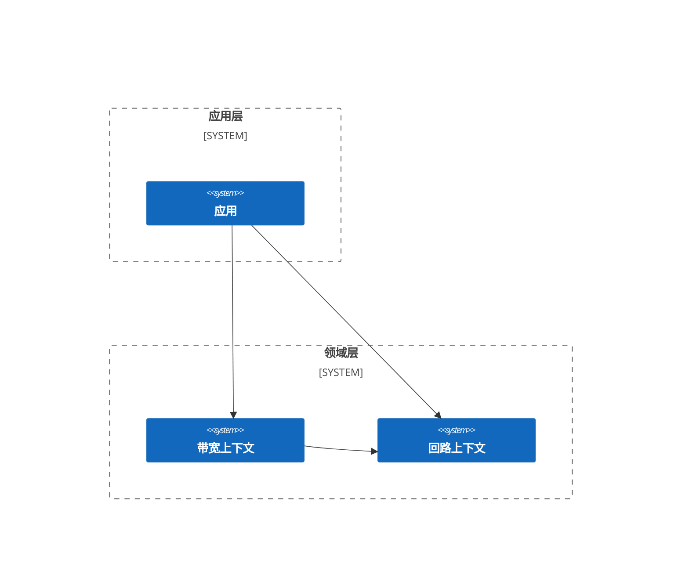

# 复杂示例 1：服务器放置问题

## 问题描述

在给定结构的电信网络中，为了视频内容快速低成本的传送到每个住户小区，需要在这个给定网络结构中选择一些网络节点附近放置视频内容存储服务器。

<div align="center">
  
</div>

现已知：
1. 每条链路有带宽 $Bandwidth^{Max}$ 与带宽成本 $Cost^{Bandwidth}$ ；
2. 每台服务器有负荷能力 $Capacity$ 与使用成本 $Cost^{Service}$ ；
3. 每个消费节点有需求 $Demand$ 。

给出视频内容存储服务器放置位置以及带宽链路，令服务器使用成本最小、链路使用成本最小，并满足以下条件：
1. 每个节点最多部署一台服务器；
2. 每台服务器最多部署到一个节点上；
3. 满足所有的住户小区视频播放需求；
4. 中转节点流量要平衡。

## 业务架构



## 数学模型

### 回路上下文

#### 变量

$x_{is} \in \{0, 1\}$：在普通节点 $i$ 部署服务器 $s$ 。

#### 中间值

##### 1. 是否在节点部署服务器

$$
Assignment^{Node}_{i} = \sum_{s \in S} x_{is}, \; \forall i \in N^{N}
$$

##### 2. 是否部署了服务器

$$
Assignment^{Service}_{s} = \sum_{i \in N^{N}} x_{is}, \; \forall s \in S
$$

#### 目标函数

##### 1. 服务器部署成本最小

**描述**：服务器的使用成本尽可能少。

$$
min \quad \sum_{s \in S} Cost^{Service}_{s} \cdot Assignment^{Service}_{s}
$$

#### 约束

##### 1. 节点部署约束

**描述**：每个节点最多部署一台服务器。

$$
s.t. \quad Assignment^{Node}_{i} \leq 1, \; \forall i \in N^{N}
$$

##### 2. 服务器部署约束

**描述**：每个服务器最多部署到一个节点。

$$
s.t. \quad Assignment^{Service}_{s} \leq 1, \; \forall s \in S
$$

### 带宽上下文

#### 变量

$y_{e_{ij}, s} \in R^{\ast}$：服务器 $s$ 占用普通节点 $i$ 到节点 $j$ 之前链路的带宽。

#### 中间值

##### 1. 使用带宽

$$
Bandwidth_{e_{ij}} = \sum_{s \in S} y_{e_{ij}, s}, \; \forall i \in N^{N}, \; \forall j \in N
$$

##### 2. 下行带宽

$$
Bandwidth^{Indegree, Service}_{js} = \sum_{i \in N^{N}} y_{e_{ij}, s}, \; \forall j \in N, \; \forall s \in S
$$

$$
Bandwidth^{Indegree, Node}_{j} = \sum_{s \in S} Bandwidth^{Indegree, Service}_{js}, \; \forall j \in N
$$

##### 3. 上行带宽

$$
Bandwidth^{Outdegree, Service}_{is} = \sum_{j \in N} y_{e_{ij}, s}, \; \forall i \in N^{N}, \; \forall s \in S
$$

$$
Bandwidth^{Outdegree, Node}_{i} = \sum_{s \in S} Bandwidth^{Outdegree, Service}_{js}, \; \forall i \in N^{N}
$$

##### 4. 净流出带宽

$$
Bandwidth^{OutFlow, Service}_{is} = Bandwidth^{Outdegree, Service}_{is} - Bandwidth^{Indegree, Service}_{is}, \; \forall i \in N^{N}, \; \forall s \in S
$$

$$
Bandwidth^{OutFlow, Node}_{i} = \sum_{s \in S} Bandwidth^{OutFlow, Service}_{is}, \; \forall i \in N^{N}
$$

#### 目标函数

##### 1. 链路带宽使用成本最小

**描述**：链路带宽的使用成本尽可能少。

$$
min \quad \sum_{i \in N^{N}}\sum_{j \in N^{N}} Cost^{Bandwidth}_{e_{ij}} \cdot Bandwidth_{e_{ij}}
$$

#### 约束

##### 1. 链路带宽约束

**描述**：链路使用带宽不超过链路最大值，且只有服务器可以使用带宽。

$$
s.t. \quad y_{e_{ij}, s} \leq Bandwidth^{Max}_{e_{ij}} \cdot Assignment^{Service}_{s}, \; \forall i \in N^{N}, \; \forall j \in N, \; \forall s \in S
$$

##### 2. 终端节点需求约束

**描述**：要满足消费节点需求。

$$
s.t. \quad Bandwidth^{Indegree, Node}_{i} \geq Demand_{i}, \; \forall i \in N^{C}
$$

##### 3. 中转节点流量约束

**描述**：中转节点流量要平衡。

$$
s.t. \quad Bandwidth^{OutFlow, Node}_{i} \leq Bandwidth^{Max, Outdegree}_{i} \cdot Assignment^{Node}_{i}, \; \forall i \in N^{N}
$$

其中：

$$
Bandwidth^{Max, Outdegree}_{i} = \sum_{j \in N} Bandwidth^{Max}_{e_{ij}}, \; \forall i \in N^{N}
$$

##### 4. 服务器容量约束

**描述**：服务器节点净输出不大于服务器能力。

$$
s.t. \quad Bandwidth^{OutFlow, Service}_{is} \leq Capacity_{s} \cdot x_{is}, \; \forall i \in N^{N}, \; \forall s \in S
$$

## 代码实现 {#code-implementation}

### 回路上下文

::: code-group

```kotlin
import fuookami.ospf.kotlin.utils.math.*
import fuookami.ospf.kotlin.utils.concept.*
import fuookami.ospf.kotlin.utils.functional.*
import fuookami.ospf.kotlin.utils.multi_array.*
import fuookami.ospf.kotlin.core.frontend.variable.*
import fuookami.ospf.kotlin.core.frontend.expression.monomial.*
import fuookami.ospf.kotlin.core.frontend.expression.polynomial.*
import fuookami.ospf.kotlin.core.frontend.expression.symbol.*
import fuookami.ospf.kotlin.core.frontend.inequality.*
import fuookami.ospf.kotlin.core.frontend.model.mechanism.*

class Service(
    val capacity: UInt64,
    val cost: UInt64
) : AutoIndexed(Service::class) {}

sealed class Node(
    val edges: List<Edge>
) : AutoIndexed(Node::class) {}

class NormalNode(
    edges: List<Edge>
) : Node(edges) {}

class ClientNode(
    edges: List<Edge>,
    val demand: UInt64
) : Node(edges) {}

class Edge(
    val from: Node,
    val to: Node,
    val maxBandwidth: UInt64,
    val costPerBandwidth: UInt64
) : AutoIndexed(Edge::class) {}

data class Graph(
    val nodes: ArrayList<Node>,
    val edges: ArrayList<Edge>
) {}

// 定义决策对象
class Assignment(
    private val nodes: List<Node>,
    private val services: List<Service>
) {
    lateinit var x: BinVariable2
    lateinit var nodeAssignment: LinearIntermediateSymbols1
    lateinit var serviceAssignment: LinearIntermediateSymbols1

    fun register(model: LinearMetaModel) {
        if (!::x.isInitialized) {
            x = BinVariable2("x", Shape2(nodes.size, services.size))
            for (service in services) {
                for (node in nodes.filter { it is NormalNode }) {
                    x[node, service].name = "${x.name}_${node}_$service"
                }
                for (node in nodes.filter { it is ClientNode }) {
                    val variable = x[node, service]
                    variable.name = "${x.name}_${node}_$service"
                    variable.range.eq(false)
                }
            }
        }
        model.add(x)

        if (!::nodeAssignment.isInitialized) {
            nodeAssignment = flatMap(
                "node_assignment",
                nodes,
                { n ->
                    if (n is NormalNode) {
                        sum(x[n, _a])
                    } else {
                        LinearPolynomial()
                    }
                },
                { (_, n) -> "$n" }
            )
        }
        model.add(nodeAssignment)

        if (!::serviceAssignment.isInitialized) {
            serviceAssignment = flatMap(
                "service_assignment",
                services,
                { s -> sumVars(nodes.filter { it is NormalNode }) { n -> x[n, s] } },
                { (_, s) -> "$s" }
            )
        }
        model.add(serviceAssignment)
    }
}

// 定义上下文
class RouteContext(
    val graph: Graph,
    val services: List<Service>,
) {
    lateinit var assignment: Assignment

    fun register(model: LinearMetaModel) {
        // 注册变量、中间值到模型中
        if (!::assignment.isInitialized) {
            assignment = Assignment(graph.nodes, services)
        }
        assignment.register(model)

        // 定义目标函数
         model.minimize(
            sum(services) { it.cost * assignment.serviceAssignment[it] },
            "service cost"
        )

        // 定义约束条件
        for (node in graph.nodes.filter { it is NormalNode }) {
            model.addConstraint(
                assignment.nodeAssignment[node] leq 1,
                "node_assignment_$node"
            )
        }

        for (service in services) {
            model.addConstraint(
                assignment.serviceAssignment[service] leq 1,
                "service_assignment_$service"
            )
        }
    }
}
```

:::

### 带宽上下文

::: code-group

```kotlin
import fuookami.ospf.kotlin.utils.math.*
import fuookami.ospf.kotlin.utils.functional.*
import fuookami.ospf.kotlin.utils.multi_array.*
import fuookami.ospf.kotlin.core.frontend.variable.*
import fuookami.ospf.kotlin.core.frontend.expression.monomial.*
import fuookami.ospf.kotlin.core.frontend.expression.polynomial.*
import fuookami.ospf.kotlin.core.frontend.expression.symbol.*
import fuookami.ospf.kotlin.core.frontend.inequality.*
import fuookami.ospf.kotlin.core.frontend.model.mechanism.*

// 定义决策对象
class EdgeBandwidth(
    private val edges: List<Edge>,
    private val services: List<Service>
) {
    lateinit var y: UIntVariable2
    lateinit var bandwidth: LinearIntermediateSymbols1

    fun register(model: LinearMetaModel) {
        if (!::y.isInitialized) {
            y = UIntVariable2("y", Shape2(edges.size, services.size))
            for (service in services) {
                for (edge in edges.filter(from(normal))) {
                    y[edge, service].name = "${y.name}_${edge}_$service"
                    y[edge, service].range.leq(edge.maxBandwidth)
                }
                for (edge in edges.filter(!from(normal))) {
                    y[edge, service].range.eq(UInt64.zero)
                }
            }
        }
        model.add(y)

        if (!::bandwidth.isInitialized) {
            bandwidth = flatMap(
                "bandwidth",
                edges,
                { e ->
                    if (e.from is NormalNode) {
                        sum(y[e, _a])
                    } else {
                        LinearPolynomial()
                    }
                },
                { (_, e) -> "$e" }
            )
        }
        model.add(bandwidth)
    }
}

class ServiceBandwidth(
    private val graph: Graph,
    private val services: List<Service>,
    private val edgeBandwidth: EdgeBandwidth
) {
    lateinit var inDegree: LinearIntermediateSymbols2
    lateinit var outDegree: LinearIntermediateSymbols2
    lateinit var outFlow: LinearIntermediateSymbols2

    fun register(model: LinearMetaModel) {
        val y = edgeBandwidth.y
        val to: (Node) -> Predicate<Edge> =
            { fuookami.ospf.kotlin.example.framework_demo.demo1.domain.route_context.model.to(it) }

        if (!::inDegree.isInitialized) {
            inDegree = flatMap(
                "bandwidth_indegree_service",
                graph.nodes,
                services,
                { n, s -> sumVars(graph.edges.filter(to(n))) { e -> y[e, s] } },
                { (_, n), (_, s) -> "${n}_$s" }
            )
        }
        model.add(inDegree)

        if (!::outDegree.isInitialized) {
            outDegree = flatMap(
                "bandwidth_outdegree_service",
                graph.nodes,
                services,
                { n, s ->
                    if (n is NormalNode) {
                        sumVars(graph.edges.filter(from(n))) { e -> y[e, s] }
                    } else {
                        LinearPolynomial()
                    }
                },
                { (_, n), (_, s) -> "${n}_$s" }
            )
        }
        model.add(outDegree)

        if (!::outFlow.isInitialized) {
            outFlow = flatMap(
                "bandwidth_outflow_service",
                graph.nodes,
                services,
                { n, s ->
                    if (n is NormalNode) {
                        outDegree[n, s] - inDegree[n, s]
                    } else {
                        LinearPolynomial()
                    }
                },
                { (_, n), (_, s) -> "${n}_$s" }
            )
        }
        model.add(outFlow)
    }
}

class NodeBandwidth(
    private val nodes: List<Node>,
    private val serviceBandwidth: ServiceBandwidth
) {
    lateinit var inDegree: LinearIntermediateSymbols1
    lateinit var outDegree: LinearIntermediateSymbols1
    lateinit var outFlow: LinearIntermediateSymbols1

    fun register(model: LinearMetaModel): Try {
        if (!::inDegree.isInitialized) {
            inDegree = flatMap(
                "bandwidth_indegree_node",
                nodes,
                { n -> sum(serviceBandwidth.inDegree[n, _a]) },
                { (_, n) -> "$n" }
            )
        }
        model.add(inDegree)

        if (!::outDegree.isInitialized) {
            outDegree = flatMap(
                "bandwidth_outdegree_node",
                nodes,
                { n ->
                    if (n is NormalNode) {
                        sum(serviceBandwidth.outDegree[n, _a])
                    } else {
                        LinearPolynomial()
                    }
                },
                { (_, n) -> "$n" }
            )
        }
        model.add(outDegree)

        if (!::outFlow.isInitialized) {
            outFlow = flatMap(
                "bandwidth_outflow_node",
                nodes,
                { n ->
                    if (n is NormalNode) {
                        sum(serviceBandwidth.outFlow[n, _a])
                    } else {
                        LinearPolynomial()
                    }
                },
                { (_, n) -> "$n" }
            )
        }
        model.add(outFlow)
    }
}

// 定义上下文
class BandwidthContext() {
    lateinit var edgeBandwidth: EdgeBandwidth,
    lateinit var serviceBandwidth: ServiceBandwidth,
    lateinit var nodeBandwidth: NodeBandwidth

    fun register(
        routeContext: RouteContext,
        model: LinearMetaModel
    ) {
        val graph = routeContext.graph
        val services = routeContext.services
        val assignment = routeContext.assignment

        // 注册变量、中间值到模型中
        if (!::edgeBandwidth.isInitialized) {
            edgeBandwidth = EdgeBandwidth(graph.edges, services)
        }
        edgeBandwidth.register(model)

        if (!::serviceBandwidth.isInitialized) {
            serviceBandwidth = ServiceBandwidth(graph, services, edgeBandwidth)
        }
        serviceBandwidth.register(model)

        if (!::nodeBandwidth.isInitialized) {
            nodeBandwidth = NodeBandwidth(graph.nodes, serviceBandwidth)
        }
        nodeBandwidth.register(model)

        // 定义目标函数
        model.minimize(
            sum(graph.edges.filter { it.from is NormalNode }) { 
                it.costPerBandwidth * edgeBandwidth.bandwidth[it]
            },
            "bandwidth cost"
        )

        // 定义约束
        for (edge in graph.edges.filter { it.from is NormalNode }) {
            for (service in services) {
                model.addConstraint(
                    edgeBandwidth.y[edge, service] leq assignment.assignment[service] * edge.maxBandwidth,
                    "edge_bandwidth_constraint_($edge,$service)"
                )
            }
        }

        for (node in graph.nodes.filter { it is ClientNode }) {
            model.addConstraint(
                nodeBandwidth.inDegree[node] geq (node as ClientNode).demand,
                "demand_constraint_$node"
            )
        }

        for (node in graph.nodes.filter { it.from is NormalNode }) {
            for (service in services) {
                model.addConstraint(
                    serviceBandwidth.outFlow[node, service] leq assignment.x[node, service] * service.capacity,
                    "service_capacity_constraint_($node,$service)"
                )
            }
        }

        for (node in graph.nodes.filter { it.from is NormalNode }) {
            val maxOutDegree = node.edges.sumOf { it.maxBandwidth }
            model.addConstraint(
                nodeBandwidth.outFlow[node] leq assignment.assignment[node] * maxOutDegree,
                "transfer_node_bandwidth_constraint_$node"
            )
        }
    }

    fun analyze(model: LinearMetaModel): List<List<Node>> { 
        ...
    }
}
```

:::

### 应用

::: code-group

```kotlin
import fuookami.ospf.kotlin.core.frontend.model.mechanism.*
import fuookami.ospf.kotlin.core.backend.plugins.scip.*

val graphs = ... // 图数据
val services = ... // 服务器数据

// 创建模型实例
val metaModel = LinearMetaModel("demo1")

// 创建上下文实例
val routeContext = RouteContext(graph, services)
val bandwidthContext = BandwidthContext()

// 注册上下文（变量、约束、目标函数）到模型中
routeContext.register(metaModel)
bandwidthContext.register(routeContext, metaModel)

// 调用求解器求解
val solver = ScipLinearSolver()
when (val ret = solver(metaModel)) {
    is Ok -> {
        metaModel.tokens.setSolution(ret.value.solution)
    }

    is Failed -> {}
}

// 解析结果
val solution = bandwidthContext.analyze(metaModel)
```

:::

完整实现请参考：

- [Kotlin](https://github.com/fuookami/ospf/tree/main/examples/ospf-kotlin-example/src/main/fuookami/ospf/kotlin/example/framework_demo/demo1)
