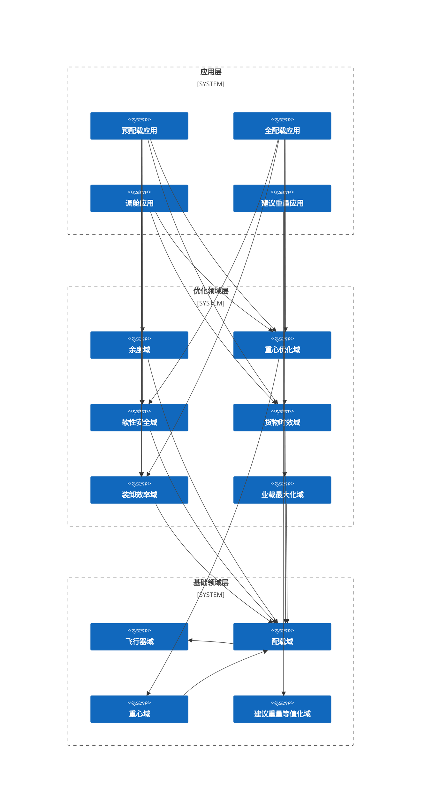

# 复杂示例 2：航空货运装载规划问题

## 问题描述

## 业务架构

## 领域 / 数学模型

### 配载域

#### 决策变量

$x_{cp} \in \{0, 1\}$ ：配载决策，无量纲量，$1$ 表示将货物 $c$ 放在舱位 $p$。

$y_{p} \in R - R^{-}$ ：预计载重量，物理量为重量，表示给舱位 $p$ 的预计载重量。

$z_{p} \in N$ ：建议载重量，物理量为重量，表示给舱位 $p$ 的建议载重量。

$u_{cp} \in \{-1, 0, 1\}$ ：调舱决策，无量纲量，$-1$ 表示将货物 $c$ 从舱位 $p$ 移走， $1$ 表示将货物 $c$ 放在舱位 $p$。

#### 中间值

##### 配载决策

**描述**：对于任意的货物 $c$ 与任意的舱位 $p$ ，该货物是否配载到该舱位上的配载决策等于配载决策与调舱决策的和。

$$
Loaded_{cp} = \begin{cases}
1,& c \in C^{Loaded}_{p} \\ \; \\
0,& c \notin C^{Loaded}_{p}
\end{cases}, \; \forall c \in C, \; \forall p \in P
$$

$$
Stowage_{cp} = \begin{cases}
x_{cp} + u_{cp} + Loaded_{cp}, & \forall c \in C^{SN}, \; \forall p \in P^{SN} \\ \; \\
Loaded_{cp},& else
\end{cases}
$$

##### 舱位载货量

**描述**：对于任意舱位 $p$ ，其舱位载货量为配载在该舱位的货物数量之和。

$$
LA^{Loaded}_{p} = |C^{Loaded}_{p}|
$$

$$
LA^{Estimate}_{p} = \begin{cases}
LA^{Loaded}_{p},& \forall p \in (P - P^{SN}) \\ \; \\
\sum_{c \in C^{SN}} Stowage_{cp} + LA^{Loaded}_{p},& \forall p \in P^{SN}
\end{cases}
$$

##### 舱位载重量

**描述**：对于任意舱位 $p$ ，其舱位预估载重量为配载在该舱位的货物重量、预计载重量与建议载重量之和，其舱位实际载重量为配载在该舱位的货物重量之和。

$$
LW^{Loaded}_{p} = \sum_{c \in C^{Loaded}_{p}} W_{c}
$$

$$
LW^{Estimate}_{p} = \begin{cases}
LW^{Loaded}_{p},& \forall p \in P^{Unavailable} \\ \; \\
\sum_{c \in C^{SN}} W_{c} \cdot Stowage_{cp} + y_{p} + LW^{Loaded}_{p},& \forall p \in P^{SN} \cap P^{PWN} \\ \; \\
\sum_{c \in C^{SN}} W_{c} \cdot Stowage_{cp} + z_{p} + LW^{Loaded}_{p},& \forall p \in P^{SN} \cap P^{RWN} \\ \; \\
\sum_{c \in C^{SN}} W_{c} \cdot Stowage_{cp} + LW^{Loaded}_{p},& \forall p \in P^{SN} - P^{PWN} - P^{RWN} \\ \; \\
y_{p} + LW^{Loaded}_{p},& \forall p \in P^{PWN} - P^{SN} \\ \; \\
z_{p} + LW^{Loaded}_{p},& \forall p \in P^{RWN} - P^{SN}
\end{cases}
$$

$$
LW^{Actual}_{p} = \begin{cases}
LW^{Loaded}_{p},& \forall p \in (P - P^{SN}) \\ \; \\
\sum_{c \in C^{SN}} W_{c} \cdot Stowage_{cp} + LW^{Loaded}_{p},& \forall p \in P^{SN}
\end{cases}
$$

##### 已打板总业载

**描述**：当前已打板货物的总重。
$$
Payload^{Boarded} = \sum_{c \in C}W_{c}
$$

##### 预估业载

**描述**：当前舱位计算载重量之和。
$$
Payload^{Estimate}_{d} = \sum_{p \in P_{d}}LW^{Estimate}_{p}, \; \forall d \in D
$$

##### 实际业载

**描述**：当前舱位实际载重量之和。
$$
Payload^{Actual}_{d} = \sum_{p \in P_{d}}LW^{Actual}_{p}, \; \forall d \in D
$$

##### 计算总业载

**描述**：如果是预配算法族，计算总业载使用预计总业载；如果是全配算法族，计算总业载使用实时总业载。
$$
Payload^{Computed} = \begin{cases}
Payload^{Plan},& Predistribution \\ \; \\
Payload^{Boarded},& FullLoad
\end{cases}
$$

##### 预估总业载

**描述**：当前舱位计算载重量之和	。
$$
Payload^{Estimate} = \begin{cases}
Payload^{Computed},& FullLoad \; \& \; Predistribution \\ \; \\
\sum_{d \in D} Payload^{Estimate}_{d},& else
\end{cases}
$$

##### 实际总业载

**描述**：当前舱位实际载重量之和。

$$
Payload^{Actual} = \begin{cases}
Payload^{Boarded},& FullLoad \; \& \; RecommendWeight \\ \; \\
\sum_{d \in D} Payload^{Actual},& else
\end{cases}
$$

### 重心域

### 适航安全域

### 重心优化域

### 软性安全域

### 货物时效域

### 装卸效率域

### 业载最大化域

### 建议重量等值化域

### 余度域

## 代码实现

完整实现请参考：

- [Kotlin](https://github.com/fuookami/ospf/tree/main/examples/ospf-kotlin-example/src/main/fuookami/ospf/kotlin/example/framework_demo/demo2)
