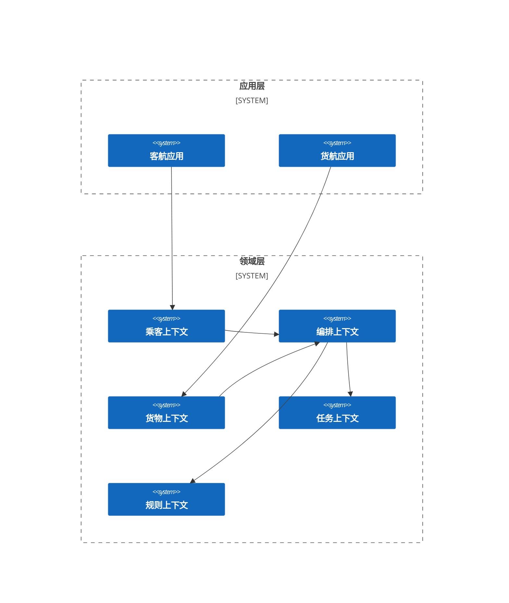

# 复杂示例 4：航班恢复问题

## 问题描述

## 业务架构

## 数学模型

### RMP

#### 编排上下文

#### 乘客上下文

#### 货物上下文

### SP

## 代码实现

完整实现请参考：

- [Kotlin](https://github.com/fuookami/ospf/tree/main/examples/ospf-kotlin-example/src/main/fuookami/ospf/kotlin/example/framework_demo/demo4)
