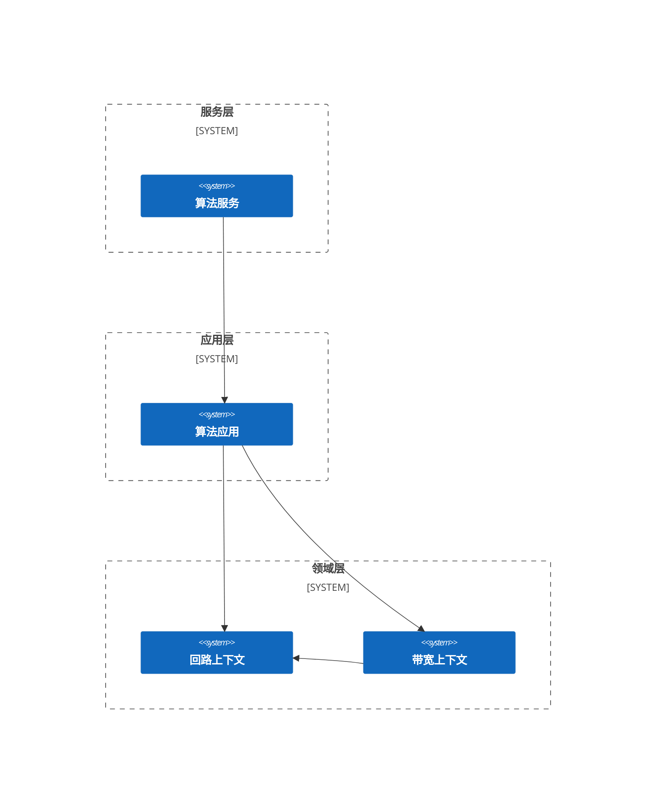
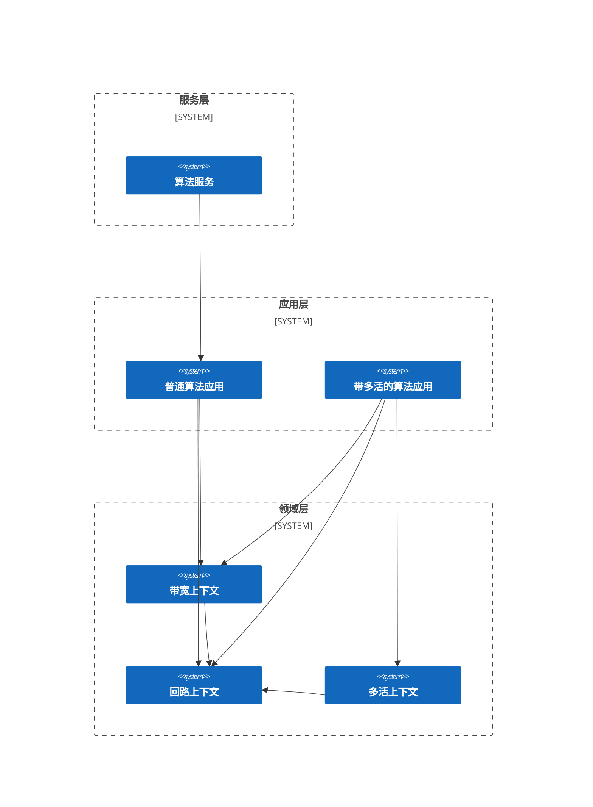

# ospf 是什么?

ospf 是一个针对复杂的运筹优化算法中建模与编码过程的解决方案及其开发组件。ospf 旨在提供一种基于<b><em>领域驱动设计</em></b>（DDD）的建模方式，以便使用者能够在整个软件生命周期都能简单、高效地开发、维护数学模型、求解算法及其实现代码。

各宿主语言的实现可以参考以下代码仓库目录：

- C++：https://github.com/fuookami/ospf-cpp
- C#：https://github.com/fuookami/ospf-csharp
- Kotlin：https://github.com/fuookami/ospf-kotlin
- Python：https://github.com/fuookami/ospf-python
- Rust：https://github.com/fuookami/ospf-rust

## 引子

软件工程师在构建复杂系统的时候，会有意无意的应用大量认知模型，正是这些有效的认知模型，帮助我们构建了当今无比复杂的信息系统，让我们进入了数字智能时代。这些认知模型包括但不限于：抽象、分层、分冶、演化、协议等，它们已经遍布于我们各种信息系统的架构设计中。

在执行认知任务过程中，我们肯定需要对信息的暂时储存与加工资源的过程，这个过程会使用到认知心理学上称作工作记忆的人类认知中枢。但工作记忆是有容量的，也就是说我们能同时认知的事物是有限的，一般认为最多能同时处理4个“块”。这个“块”可以是数字、字母、词语或其它形式。不过，如果我们掌握了一门数学或科学的技术，或是一项概念。它在工作记忆中所占据的空间就会变小。释放出的大脑空间责任可以让我们更轻松地处理其他想法。

那么抽象是怎么应用到我们的软件结构设计中的呢？简单地说，抽象就是把一些基本元素组装成一个复合元素，然后直接使用该复合元素。我们可以看到下面三段代码，这三段代码表达的是同一个语义，比较两个矩形的面积大小。它的抽象程度逐步提升。

<b>面向过程 1</b>：
```rust
fn main() {
    let length1: f64 = 10.;
    let width1: f64 = 8.;
    let area1 = length1 * width1;
    let length2: f64 = 11.;
    let width2: f64 = 7.;
    let area2 = length2 * width2;
    assert (area1 > area2);
}
```

<b>面向过程 2</b>：
```rust
fn area(length: f64, width: f64) -> f64 {
    length * width
}

fn bigger_than(length1: f64, width1: f64, length2: f64, width: f64) -> bool {
    area(length1, width1) > area(length2, width2)
}

fn main() {
    let length1: f64 = 10.;
    let width1: f64 = 8.;
    let length2: f64 = 11.;
    let width2: f64 = 7.;
    assert (bigger_than(length1, width1, length2, width2));
}
```

<b>面向对象</b>：
```rust
struct Rectangle {
    length: f64,
    width: f64
}

impl Rectangle {
    fn new(l: f64, w: f64) -> Self {
        Self {
            length: l,
            width: w
        }
    }

    fn area(&self) -> f64 {
        self.length * self.width
    }

    fn bigger_than(&self, rhs: &Self) -> bool {
        self.area() > rhs.area()
    }
}

fn main() {
    let r1 = Rectangle::new(10., 8.);
    let r2 = Rectangle::new(11., 7.);
    assert (r1.bigger_than(&r2));
}
```

第一段呢是完全没有抽象，第二段抽象了计算过程，然后使用了这些计算过程，我们一般称作面向过程。第三段既抽象了矩形这个概念，也围绕矩形抽象了计算过程，然后使用了这个概念和这些计算过程，我们一般称作面向对象。

随着抽象程度的递增，我们也很容易可以看到在主函数中代码量也在逐步降低，语义化程度也在逐步提升。即使最后这段代码的实际代码量是最大的，但在现代，基本所有程序员都会使用第三段代码的写法，我们可以依靠编译器将其翻译成同样的机器码，那么在编码过程中自然而然就会选择更加面向人类的写法。

传统的运筹学算法开发中，就缺乏了抽象的方法。缺乏抽象的方法，就会导致产品工程师与算法工程师之间、算法工程师与算法工程师之间，因为缺乏统一的公共语言而导致沟通不畅。同时，因为不能在开发实践中应用各种软件结构设计技术，数学模型的实现代码难以复用，在大规模的运筹学算法开发过程中会有大量人时消耗在重复工作中。同时，数学模型的实现代码的代码风格会严重受到算法工程师个体的影响，算法工程师之间难以开展协作。

## 中间值

ospf 提供了一种命名为“中间值”的概念，以实现基于 DDD 的建模方式。中间值在数学模型中用于表示运算的中间结果，它可以帮助简化模型的表示，并使得模型更易于理解和维护。中间值有以下特性：

- 指代一个被存储起来的具名的表达式
- 语义上等价于匿名的表达式
- 文法上等价于变量，拥有全局作用域以及静态生命周期

### 算术中间值

中间值最开始的设计目的是为了减少数学模型中的重复，所以最基本的算术中间值就是通过一个多项式来构建，然后使用者就可以在模型的任何地方使用该中间值替代所有同样的多项式。

$$
ExprSymbol = \sum_{i} x_{i}
$$

$$
min \quad ExprSymbol
$$

$$
s.t. \quad ExprSymbol \leq 1
$$

ospf 会在将模型翻译到具体求解器的接口时，自动将把每个算术中间值替换为具体的多项式，这个翻译过程对于使用者而言是无感知的，因此使用者并不需要知道这个算术中间值是通过什么变量通过什么运算实现的。

那么，我们就可以把数学模型的维护者划分为“中间值维护者”以及“使用中间值维护数学模型者”两个角色。中间值维护者负责定义以及实现中间值，使用中间值维护数学模型者不关注中间值的实现，只关注中间值的定义与行为，并使用这些中间值在数学模型中描述业务逻辑。

这个工程实践，和面向对象设计（OOD）中定义一个类把相同语义的变量、函数封装起来，使用者只需关注其行为，无需关注其实现，是一样的。有了这样的基础之后，我们就可以开始引入 DDD 了。

### 函数中间值

基于算术中间值的思想，ospf 同样可以把类似逻辑运算表达式等非算术表达式封装到中间值中。

$$
FuncSymbol = \bigvee_{i} x_{i} = Or(x_{1}, \, x_{2}, \, .. \, , \, x_{i})
$$

$$
s.t. \quad FuncSymbol = 1
$$

ospf 会在将模型翻译到具体求解器的接口时，自动添加每个函数中间值所需的中间变量以及约束。这个翻译过程对于使用者而言是无感知的，因此使用者并不需要知道这个函数中间值是通过什么中间变量以及约束实现的。比如上面的这个 $FuncSymbol = \bigvee_{i} x_{i}$ 就会被翻译成：

$$
s.t. \quad y = 1
$$

$$
\begin{cases}
  y \geq \frac{x_{i}}{\sup_{\leq}(x_{i})}, & \sup_{\leq}(x_{i}) > 1 \\\\\\
  y \geq x_{i}, & else
\end{cases}
$$

$$
y \leq \sum_{i} x_{i}
$$

$$
y \in \\{ 0, 1 \\}
$$

当然，你也可以根据自己的业务需求，拓展这些函数中间值。这个时候你要实现一些接口，以让 ospf 知道这个函数中间值需要添加哪些中间变量以及约束。

ospf-core 本身只维护有算术运算符以及逻辑运算符，实际上我们完全可以基于领域去设计并实现函数中间值，以作为领域工程的一部分。具体可以参考 ospf-framework 中面向特定问题的开发包。

## 使用 ospf 在建模时的变化

### 问题描述

在给定结构的电信网络中，为了视频内容快速低成本的传送到每个住户小区，需要在这个给定网络结构中选择一些网络节点附近放置视频内容
存储务器。

<div align="center">
  
</div>

现已知：
1. 每条链路有带宽 $Bandwidth^{Max}$ 与带宽成本 $Cost^{Bandwidth}$ ；
2. 每台服务器有负荷能力 $Capacity$ 与使用成本 $Cost^{Service}$ ；
3. 每个消费节点有需求 $Demand$ 。

给出视频内容存储服务器放置位置以及带宽链路，令服务器使用成本最小、链路使用成本最小，并满足以下条件：
1. 每个节点最多部署一台服务器；
2. 每台服务器最多部署到一个节点上；
3. 满足所有的住户小区视频播放需求；
4. 中转节点流量要平衡。

### 传统数学模型

#### 集合

$N$：节点的集合。

$N^{N}$：普通（非客户）节点的集合。

$N^{C}$：用户节点的集合。

$S$：服务器的结合。

$E$：链路的集合。

#### 常量

$Cost^{Service}_{s}$：服务器 $s$ 的使用成本。

$Cost^{Bandwidth}_{e_{ij}}$：节点 $i$ 到节点 $j$ 之间链路的单位带宽的使用成本。

$Bandwidth^{Max}_{e_{ij}}$：节点 $i$ 到节点 $j$ 之间链路的最大带宽。

$Capacity_{s}$：服务器 $s$ 的承载能力。

$Demand_{i}$：节点 $i$ 的带宽需求。

#### 变量

$x_{is}$：在普通节点 $i$ 部署服务器 $s$ 。

$y_{e_{ij}, s}$：服务器 $s$ 占用普通节点 $i$ 到节点 $j$ 之间链路的带宽。

#### 优化目标

$$
\begin{align} Min \quad
& \sum_{s \in S} Cost^{Service}_{s} \cdot \sum_{i \in N^{N}} x_{is} \tag{1} \\
& + \sum_{i \in N^{N}}\sum_{j \in N^{N}} Cost^{Bandwidth}_{e_{ij}} \cdot \sum_{s \in S} y_{e_{ij}, s} \tag{2}
\end{align}
$$

其中，$(1)$ 为服务器使用成本，$(2)$ 为宽带使用成本。

#### 约束

$$
\begin{align}
s.t. \quad & \sum_{s \in S} x_{is} \leq 1, & \; \forall i \in N^{N} \tag{3} \\
& \sum_{i \in N^{N}} x_{is} \leq 1, & \; \forall s \in S \tag{4} \\
& y_{e_{ij}, s} \leq Bandwidth^{Max}_{e_{ij}} \cdot \sum_{i \in N^{N}} x_{is}, & \; \forall i \in N^{N}, \; \forall j \in N, \; \forall s \in S \tag{5} \\
& \sum_{s \in S}\sum_{i \in N^{N}} y_{e_{ij}, s} \geq Demand_{i}, & \; \forall j \in N^{C} \tag{6} \\
& \sum_{j \in N} y_{e_{ij}, s} - \sum_{j \in N^{N}} y_{e_{ji}, s} \leq \sum_{j \in N} Bandwidth^{Max}_{e_{ij}} \cdot \sum_{s \in S} x_{js}, & \; \forall i \in N^{N} \tag{7} \\
& \sum_{j \in N} y_{e_{ij}, s} - \sum_{j \in N^{N}} y_{e_{ji}, s} \leq Capacity_{s} \cdot x_{is}, & \; \forall i \in N^{N}, \; \forall s \in S \tag{8} \\
& x_{is} \in \{0, 1\}, & \; \forall i \in N^{N}, \; \forall s \in S \tag{9} \\
& y_{e_{ij}, s} \in R^{\ast}, & \; \forall i \in N^{N}, \; \forall j \in N, \; \forall s \in S \tag{10}
\end{align}
$$

其中，$(3)$ 约束了每个节点最多部署一台服务器，$(4)$ 约束了每个服务器最多部署到一个节点，$(5)$ 约束了链路使用带宽不超过链路最大值，且只有服务器可以使用带宽，$(6)$ 约束了要满足消费节点需求，$(7)$ 约束了中转节点流量要平衡，$(8)$ 约束了服务器节点净输出不大于服务器能力，$(9)$ 和 $(10)$ 约束了决策变量的取值范围。

### 使用 ospf 建模：使用中间值对重复的部分进行抽象与封装

#### 概述

基于大规模复用的数学模型设计方法实际上就是使用基于中间值的对数学模型进行抽象设计并模块化的方法，在每个限界上下文中提炼出来的中间值即是该上下文对外的接口，其它上下文可以使用这些接口。

在该问题中，我们很容易发现两个有依赖关系的业务域：回路与带宽。回路域描述服务器是否被使用，如果被使用被部署在哪里；带宽域基于回路域，描述如果服务器集群被这么部署，在各链路上占用的带宽。接下来就以这种限界上下文划分方式进行数学建模。

#### 回路上下文

##### 变量

$x_{is} \in \{0, 1\}$：在普通节点 $i$ 部署服务器 $s$ 。

##### 中间值

###### 是否在节点部署服务器

$$
Assignment^{Node}_{i} = \sum_{s \in S} x_{is}, \; \forall i \in N^{N}
$$

###### 是否部署了服务器

$$
Assignment^{Service}_{s} = \sum_{i \in N^{N}} x_{is}, \; \forall s \in S
$$

##### 目标函数

###### 服务器部署成本最小

**描述**：服务器的使用成本尽可能少。

$$
min \quad \sum_{s \in S} Cost^{Service}_{s} \cdot Assignment^{Service}_{s}
$$

##### 约束

###### 节点部署约束

**描述**：每个节点最多部署一台服务器。

$$
s.t. \quad Assignment^{Node}_{i} \leq 1, \; \forall i \in N^{N}
$$

###### 服务器部署约束

**描述**：每个服务器最多部署到一个节点。

$$
s.t. \quad Assignment^{Service}_{s} \leq 1, \; \forall s \in S
$$

#### 带宽上下文

##### 变量

$y_{e_{ij}, s} \in R^{\ast}$：服务器 $s$ 占用普通节点 $i$ 到节点 $j$ 之前链路的带宽。

##### 中间值

###### 使用带宽

$$
Bandwidth_{e_{ij}} = \sum_{s \in S} y_{e_{ij}, s}, \; \forall i \in N^{N}, \; \forall j \in N
$$

###### 下行带宽

$$
Bandwidth^{Indegree, Service}_{js} = \sum_{i \in N^{N}} y_{e_{ij}, s}, \; \forall j \in N, \; \forall s \in S
$$

$$
Bandwidth^{Indegree, Node}_{j} = \sum_{s \in S} Bandwidth^{Indegree, Service}_{js}, \; \forall j \in N
$$

###### 上行带宽

$$
Bandwidth^{Outdegree, Service}_{is} = \sum_{j \in N} y_{e_{ij}, s}, \; \forall i \in N^{N}, \; \forall s \in S
$$

$$
Bandwidth^{Outdegree, Node}_{i} = \sum_{s \in S} Bandwidth^{Outdegree, Service}_{js}, \; \forall i \in N^{N}
$$

###### 净流出带宽

$$
Bandwidth^{OutFlow, Service}_{is} = Bandwidth^{Outdegree, Service}_{is} - Bandwidth^{Indegree, Service}_{is}, \; \forall i \in N^{N}, \; \forall s \in S
$$

$$
Bandwidth^{OutFlow, Node}_{i} = \sum_{s \in S} Bandwidth^{OutFlow, Service}_{is}, \; \forall i \in N^{N}
$$

##### 目标函数

###### 链路带宽使用成本最小

**描述**：链路带宽的使用成本尽可能少。

$$
min \quad \sum_{i \in N^{N}}\sum_{j \in N^{N}} Cost^{Bandwidth}_{e_{ij}} \cdot Bandwidth_{e_{ij}}
$$

##### 约束

###### 链路带宽约束

**描述**：链路使用带宽不超过链路最大值，且只有服务器可以使用带宽。

$$
s.t. \quad y_{e_{ij}, s} \leq Bandwidth^{Max}_{e_{ij}} \cdot Assignment^{Service}_{s}, \; \forall i \in N^{N}, \; \forall j \in N, \; \forall s \in S
$$

###### 终端节点需求约束

**描述**：要满足消费节点需求。

$$
s.t. \quad Bandwidth^{Indegree, Node}_{i} \geq Demand_{i}, \; \forall i \in N^{C}
$$

###### 中转节点流量约束

**描述**：中转节点流量要平衡。

$$
s.t. \quad Bandwidth^{OutFlow, Node}_{i} \leq Bandwidth^{Max, Outdegree}_{i} \cdot Assignment^{Node}_{i}, \; \forall i \in N^{N}
$$

其中：

$$
Bandwidth^{Max, Outdegree}_{i} = \sum_{j \in N} Bandwidth^{Max}_{e_{ij}}, \; \forall i \in N^{N}
$$

###### 4. 服务器容量约束

**描述**：服务器节点净输出不大于服务器能力。

$$
s.t. \quad Bandwidth^{OutFlow, Service}_{is} \leq Capacity_{s} \cdot x_{is}, \; \forall i \in N^{N}, \; \forall s \in S
$$

代码实现可参考：[示例页面](/zh-cn/examples/framework-example1)

#### 业务架构与集成架构

基于大规模复用的数学模型设计方法将数学模型划分为了回路上下文与带宽上下文两个部分，其实同样也把一整块的服务器放置业务划分为了回路和带宽两个主题。最终交付的算法应用负责把这两部分组合起来，提供一个完整的算法服务，这个过程一般称作<b>映射问题空间到解决方案空间。</b>它会带来一个特点就是，集成架构的领域层、应用层与业务架构有相同的结构。



假如我们还有不同的用户，在这些基础业务上，有多活的需求，那么我们同样地可以把多活的业务拆解出来，并实现成一个多活上下文，构建一个同时集成有回路上下文、带宽上下文与多活上下文的考虑多活的算法应用，我们就能在复用回路上下文与带宽上下文的前提下，相较于重新实现，相对快速交付地这个考虑多活的算法应用。



泛化地说，假如我们能仔细规划领域层中上下文的划分并实现，构造一个类似知识库的运筹学数学模型库，我们就能基于这些限界上下文进行集成并快速交付用户所需的算法应用。一般称构筑这些库组件的过程为<b>领域工程</b>。

## 组件

ospf 采用内部<strong><em>领域特定语言</em></strong>（DSL） 的形式进行设计与实现，除了部分公共组件外，其余部分均在目标宿主语言上实现。

### 公共组件

- <strong>[examples](https://github.com/fuookami/ospf/tree/main/examples)</strong>: 样例，用于展示如何使用 ospf 进行建模、求解。

- <strong>[framework](https://github.com/fuookami/ospf/tree/main/framework)</strong>: 面向特定问题开发包的公用组件，包含结果可视化工具。

- <strong>[remote](https://github.com/fuookami/ospf/tree/main/remote)</strong>: 远程求解调度器与服务端，用于在服务器上运行求解器，并通过网络接口获取结果。

### 宿主语言实现组件

每一个 ospf 实现包含以下组件：

- <strong>utils</strong>: 工具集，包含实现 ospf dsl 所需的类与函数。
- <strong>core</strong>: 核心组件，包含建模、求解器接口、结果处理等核心功能。
  - <strong>core-plugin-XXX</strong>: 求解器插件，用于实现面向具体求解器的求解器接口。
  - <strong>core-plugin-heuristic</strong>: 元启发式算法插件，包含了许多通用的元启发式算法的实现。
- <strong>framework</strong>: 面向特定问题的框架，包含了面向特定问题的数据处理、数学模型以及求解算法的实现。所有设计与实现的都是非侵入式的，用户既可以开箱即用，也可以基于框架进行扩展，可以与其他框架或组件无缝集成。
  - <strong>framework-plugin-XXX</strong>: 框架插件，用于实现需要中间件参与的功能，比如数据持久化、异步消息通信。
  - <strong>bpp1d</strong>: 一维装箱问题开发包，包含了许多一维装箱问题的数据处理、数学模型以及求解算法的实现。
  - <strong>bpp2d</strong>: 二维装箱问题开发包，包含了许多二维装箱问题的数据处理、数学模型以及求解算法的实现。
  - <strong>bpp3d</strong>: 三维装箱问题开发包，包含了许多三维装箱问题的数据处理、数学模型以及求解算法的实现。
  - <strong>csp1d</strong>: 一维下料问题开发包，包含了许多一维下料问题的数据处理、数学模型以及求解算法的实现。
  - <strong>csp2d</strong>: 二维下料问题开发包，包含了许多二维下料问题的数据处理、数学模型以及求解算法的实现。
  - <strong>gantt-scheduling</strong>: 甘特图调度问题开发包，包含了许多甘特图调度问题的数据处理、数学模型以及求解算法的实现。可用于类似生产排程（APS）、批次生产（LSP）等调度、规划问题。
  - <strong>network-scheduling</strong>: 网络调度问题开发包，包含了许多网络调度问题的数据处理、数学模型以及求解算法的实现。可用于类似车辆调度（VRP）、设施选址（FLP）等调度、规划问题。

## 特性与进度

- ✔️：稳定版本。
- ⭕：开发完成，未稳定版本。
- ❗：正在开发，未完成版本。
- ❌：计划中，未开始。

### Core

<div style="width: auto; display: table; margin-left: auto; margin-right: auto;">
  <table style="text-align: center;">
    <thead>
      <tr>
        <th>特性</th>
        <th>C++</th>
        <th>C#</th>
        <th>Kotlin</th>
        <th>Python</th>
        <th>Rust</th>
      </tr>
    </thead>
    <tbody>
      <tr>
        <td colspan=6>建模语言</td>
      </tr>
      <tr>
        <td>MILP</td>
        <td>❗</td>
        <td>❌</td>
        <td>✔️</td>
        <td>❌</td>
        <td>❗</td>
      </tr>
      <tr>
        <td>MIQCQP</td>
        <td>❌</td>
        <td>❌</td>
        <td>✔️</td>
        <td>❌</td>
        <td>❌</td>
      </tr>
      <tr>
        <td>MINLP</td>
        <td>❌</td>
        <td>❌</td>
        <td>❌</td>
        <td>❌</td>
        <td>❌</td>
      </tr>
      <tr>
        <td colspan=6>求解器接口</td>
      </tr>
      <tr>
        <td>COPIN-OR</td>
        <td>❗</td>
        <td>❌</td>
        <td>❗</td>
        <td>❌</td>
        <td>❗</td>
      </tr>
      <tr>
        <td>COPT</td>
        <td>❌</td>
        <td>❌</td>
        <td>✔️</td>
        <td>❌</td>
        <td>❌</td>
      </tr>
      <tr>
        <td>CPLEX</td>
        <td>❗</td>
        <td>❌</td>
        <td>✔️</td>
        <td>❌</td>
        <td>❗</td>
      </tr>
      <tr>
        <td>GUROBI</td>
        <td>❗</td>
        <td>❌</td>
        <td>✔️</td>
        <td>❌</td>
        <td>❗</td>
      </tr>
      <tr>
        <td>GUROBI-11</td>
        <td>❗</td>
        <td>❌</td>
        <td>✔️</td>
        <td>❌</td>
        <td>❗</td>
      </tr>
      <tr>
        <td>HEXALY</td>
        <td>❗</td>
        <td>❌</td>
        <td>✔️</td>
        <td>❌</td>
        <td>❗</td>
      </tr>
      <tr>
        <td>LINGO</td>
        <td>❗</td>
        <td>❌</td>
        <td>❗</td>
        <td>❌</td>
        <td>❗</td>
      </tr>
      <tr>
        <td>MINDOPT</td>
        <td>❗</td>
        <td>❌</td>
        <td>✔️</td>
        <td>❌</td>
        <td>❗</td>
      </tr>
      <tr>
        <td>MOSEK</td>
        <td>❗</td>
        <td>❌</td>
        <td>✔️</td>
        <td>❌</td>
        <td>❗</td>
      </tr>
      <tr>
        <td>OPTVERSE</td>
        <td>❗</td>
        <td>❌</td>
        <td>❗</td>
        <td>❌</td>
        <td>❗</td>
      </tr>
      <tr>
        <td>SCIP</td>
        <td>❗</td>
        <td>❌</td>
        <td>✔️</td>
        <td>❌</td>
        <td>❗</td>
      </tr>
      <tr>
        <td>其它</td>
        <td colspan=5>计划中</td>
      </tr>
      <tr>
        <td colspan=6>元启发式算法</td>
      </tr>
      <tr>
        <td>PSO</td>
        <td>❗</td>
        <td>❌</td>
        <td>✔️</td>
        <td>❌</td>
        <td>❗</td>
      </tr>
      <tr>
        <td>GA</td>
        <td>❗</td>
        <td>❌</td>
        <td>✔️</td>
        <td>❌</td>
        <td>❗</td>
      </tr>
      <tr>
        <td>MVO</td>
        <td>❗</td>
        <td>❌</td>
        <td>✔️</td>
        <td>❌</td>
        <td>❗</td>
      </tr>
      <tr>
        <td>SAA</td>
        <td>❗</td>
        <td>❌</td>
        <td>✔️</td>
        <td>❌</td>
        <td>❗</td>
      </tr>
      <tr>
        <td>HCA</td>
        <td>❗</td>
        <td>❌</td>
        <td>❗</td>
        <td>❌</td>
        <td>❗</td>
      </tr>
      <tr>
        <td>NMS</td>
        <td>❗</td>
        <td>❌</td>
        <td>❗</td>
        <td>❌</td>
        <td>❗</td>
      </tr>
      <tr>
        <td>其它</td>
        <td colspan=5>计划中</td>
      </tr>
    </tbody>
  </table>
</div>

### Framework

<div style="width: auto; display: table; margin-left: auto; margin-right: auto;">
  <table style="text-align: center;">
    <thead>
      <tr>
        <th>特性</th>
        <th>C++</th>
        <th>C#</th>
        <th>Kotlin</th>
        <th>Python</th>
        <th>Rust</th>
        <th>可视化</th>
      </tr>
    </thead>
    <tbody>
      <tr>
        <td>基础框架</td>
        <td>❗</td>
        <td>❌</td>
        <td>✔️</td>
        <td>❌</td>
        <td>❗</td>
        <td></td>
      </tr>
      <tr>
        <td>一维装箱</td>
        <td>❌</td>
        <td>❌</td>
        <td>❌</td>
        <td>❌</td>
        <td>❌</td>
        <td>❌</td>
      </tr>
      <tr>
        <td>二维装箱</td>
        <td>❌</td>
        <td>❌</td>
        <td>❌</td>
        <td>❌</td>
        <td>❌</td>
        <td>❌</td>
      </tr>
      <tr>
        <td>三维装箱</td>
        <td>❌</td>
        <td>❌</td>
        <td>✔️</td>
        <td>❌</td>
        <td>❌</td>
        <td>✔️</td>
      </tr>
      <tr>
        <td>一维下料</td>
        <td>❌</td>
        <td>❌</td>
        <td>⭕</td>
        <td>❌</td>
        <td>❌</td>
        <td>✔️</td>
      </tr>
      <tr>
        <td>二维下料</td>
        <td>❌</td>
        <td>❌</td>
        <td>❌</td>
        <td>❌</td>
        <td>❌</td>
        <td>❌</td>
      </tr>
      <tr>
        <td>甘特图调度</td>
        <td>❌</td>
        <td>❌</td>
        <td>✔️</td>
        <td>❌</td>
        <td>❌</td>
        <td>✔️</td>
      </tr>
      <tr>
        <td>网络流调度</td>
        <td>❌</td>
        <td>❌</td>
        <td>❌</td>
        <td>❌</td>
        <td>❌</td>
        <td>❌</td>
      </tr>
      <tr>
        <td>其它</td>
        <td colspan=6>计划中</td>
      </tr>
    </tbody>
  </table>
</div>

### Remote

<div style="width: auto; display: table; margin-left: auto; margin-right: auto;">
  <table style="text-align: center;">
    <thead>
      <tr>
        <th>特性</th>
        <th></th>
      </tr>
    </thead>
    <tbody>
      <tr>
        <td>求解器服务端</td>
        <td>❗</td>
      </tr>
      <tr>
        <td>元启发式算法服务端</td>
        <td>❌</td>
      </tr>
      <tr>
        <td>调度器</td>
        <td>❗</td>
      </tr>
      <tr>
        <td>时间片轮转</td>
        <td>❌</td>
      </tr>
    </tbody>
  </table>
</div>
